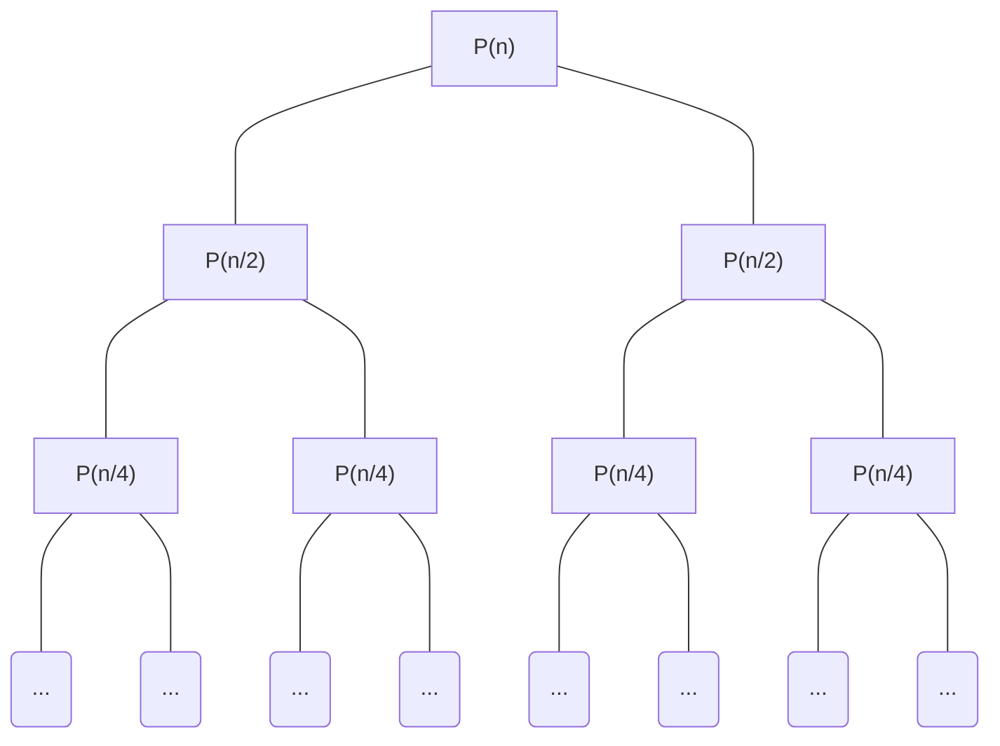

# X 的 N 次幂

**问题**：求x的n次幂，n大于0

## 解题思路

通常采用分治法
设$x^n$为$P(n)$，则
$$
\begin{align}
P(n) &= x^n \\
    \ &=\begin{cases}
    \ &=x^{n/2}*x^{n/2} &(如果n为偶数)\\
    \ &=x^{n/2}*x^{n/2}*x &(如果n为奇数)\\
    \end{cases}\\
    \ &=\begin{cases}
    \ &=P(n/2)*P(n/2)&(如果n为偶数)\\
    \ &=P(n/2)*P(n/2)*x&(如果n为奇数)\\
    \end{cases}\\
\end{align}
$$

根据上述公式写出递归代码

```c++
long long myPow(int x, int n){
    if(x == 0 || x == 1) return x;
    if(n == 0)return 1;
    if(n == 1) return x;
    long long res = myPow(x, n/2) * myPow(x, n/2);
    if(n % 2 == 0) 
        return res;
    else return res * x;
}
```

很显然，这种**从上往下**的做法存在很多的重叠子问题



所以我们需要使用**从下往上**的循环

每次保存$P(n/2)$，这样求$P(n)$的时候，可以直接通过$P(n/2)*P(n/2)`的方式

也就是说，对于一个幂数$n$为$2^i$的情况而言,可以通过以下方法求出结果

```c++
int i = 1, res = x;
while(i<n){
    res *= res;
    ++i;
}
```

回到问题本身，可以将`pow(x, n)`展开如下

$$
\begin{align}

x^n &= c_0x * c_1x^2 * c_2x^4 * ... c_ix^{2^i} &(c_i为 0 或者 1 ) \\

    \ &= \prod_{i=0}^{i}c_ix^{2^i} &(c_i为 0 或者 1 )

\end{align}
$$

所以**问题难点**在于

1. 如何确认$x^{2^i}$对应的$c_i$是否为`1`
   > 也就是，结果`res`是否需要乘算上$x^{2^i}$
2. 如何找到最大的`i`

**解决方案**：使用二进制

`n`可以转换成32位二进制形式

而其二进制形式的意义为

$$
\begin{align}
n &= c_0*2^0 + c_1*2^1 + ... c_i * 2^i \\
&= \sum_{i=0}^i{c_i*2^i}
\end{align}
$$

所以

### 对于第一个问题:如何确认$x^{2^i}$对应的$c_i$是否为`1`

可以根据`n`的二进制每一位，来确定`pow(x, n)`要乘算上的$x^{2^i}$

可以通过判断`num & 1 << i`的结果是否为`0`，来知道`n`第`i`位是否为`1`——当第`i`位为`1`时，`res` 乘算上 $x^{2^i}$

同时，使用一个临时变量 `temp` 存储每一个$x^{2^i}$，这样计算$x^{2^i}$时，可以通过上一个值$x^{2^{i-1}}$,也就是`temp *= temp`的方式计算

### 对于第二个问题:如何找到最大的`i`

可以使用`n & (n-1)`的方式，不断将最右边的`1`变成`0`

当`n`的所有`1`都变成`0`时，也就是`n == 0`时，结束循环

> 由于`n`为整型，所以一共也就32位，可以将32位遍历完，也不会太影响效率

## 代码

```c++
    bool invalidInput = false;
    double myPow(double x, int n) {
        //保证n大于0
        if(n < 0) {
            invalidInput = true;
            return 0.0;
        }
        //边界值处理
        if( n == 0) return 1.0;
        if( x == 0 || x == 1) return x;
        if( x == -1.0){
            if((n &1) == 0) return 1.0;
            else return x;
        }
        int n0 = n;
        double temp; // 使用 temp 保存 pow(x, pow(2, i))
        double res = 1;
        for(int i = 0; i < 32 && n0 > 0; ++i){
            if(i == 0){
                temp = x;
            }else{
                temp *= temp;
            }
            if((n & (1 << i)) != 0){ //判断 n 第 i 位是否为1
                res *= temp;
                n0 = n0 & (n0-1); //消除 n0 最右侧1
            }
        }
        return res;
    }
```
