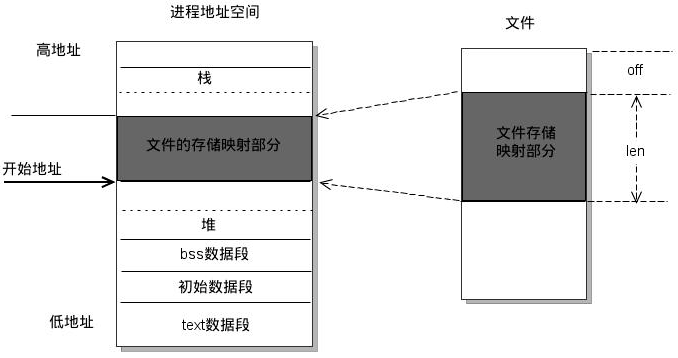

### 2.21 说说进程空间从高位到低位都有些什么？

**参考回答**


如上图，**从高地址到低地址，一个程序由命令行参数和环境变量、栈、文件映射区、堆、BSS段、数据段、代码段组成。**

1. **命令行参数和环境变量**
2. **栈区：**存储局部变量、函数参数值。栈从高地址向低地址增长。是一块连续的空间。
3. **文件映射区**，位于堆和栈之间。
4. **堆区：**动态申请内存用。堆从低地址向高地址增长。
5. **BSS 段**：存放程序中未初始化的全局变量和静态变量的一块内存区域。
6. **数据段**：存放程序中已初始化的全局变量和静态变量的一块内存区域。
7. **代码段：**存放程序执行代码的一块内存区域。只读，代码段的头部还会包含一些只读的常数变量。

### 2.22 32位系统能访问4GB以上的内存吗？

**参考回答**

**正常情况下是不可以的**。原因是计算机使用二进制，每位数只有0或1两个状态，32位正好是2的32次方，正好是4G，所以大于4G就没办法表示了，而在32位的系统中，因其它原因还需要占用一部分空间，所以内存只能识别3G多。要使用4G以上就只能换64位的操作系统了。

但是使用**PAE技术**就可以实现 32位系统能访问4GB以上的内存。

**答案解析**

Physical Address Extension（PAE）技术最初是为了弥补32位地址在PC服务器应用上的不足而推出的。我们知道，传统的IA32架构只有32位地址总线，只能让系统容纳不超过4GB的内存，这么大的内存，对于普通的桌面应用应该说是足够用了。可是，对于服务器应用来说，还是显得不足，因为服务器上可能承载了很多同时运行的应用。PAE技术将地址扩展到了36位，这样，系统就能够容纳2^36=64GB的内存。

### 2.23 请你说说并发和并行

**参考回答**

1. **并发**：对于单个CPU，在一个时刻只有一个进程在运行，但是线程的切换时间则减少到纳秒数量级，多个任务不停来回快速切换。
2. **并行**：对于多个CPU，多个进程同时运行。
3. **区别**。通俗来讲，它们虽然都说是"多个进程同时运行"，但是它们的"同时"不是一个概念。并行的"同时"是同一时刻可以多个任务在运行(处于running)，并发的"同时"是经过不同线程快速切换，使得看上去多个任务同时都在运行的现象。

### 2.24 说说进程、线程、协程是什么，区别是什么？

**参考回答**

1. **进程**：程序是指令、数据及其组织形式的描述，而进程则是程序的运行实例，包括程序计数器、寄存器和变量的当前值。
2. **线程**：微进程，一个进程里更小粒度的执行单元。一个进程里包含多个线程并发执行任务。
3. **协程**：协程是微线程，在子程序内部执行，可在子程序内部中断，转而执行别的子程序，在适当的时候再返回来接着执行。

**区别**：

1. **线程与进程的区别**：

   （1）一个线程从属于一个进程；一个进程可以包含多个线程。

   （2）一个线程挂掉，对应的进程挂掉；一个进程挂掉，不会影响其他进程。

   （3）进程是系统资源调度的最小单位；线程CPU调度的最小单位。

   （4）进程系统开销显著大于线程开销；线程需要的系统资源更少。

   （5）进程在执行时拥有独立的内存单元，多个线程共享进程的内存，如代码段、数据段、扩展段；但每个线程拥有自己的栈段和寄存器组。

   （6）进程切换时需要刷新TLB并获取新的地址空间，然后切换硬件上下文和内核栈，线程切换时只需要切换硬件上下文和内核栈。

   （7）通信方式不一样。

   （8）进程适应于多核、多机分布；线程适用于多核

2. **线程与协程的区别：**

   （1）协程执行效率极高。协程直接操作栈基本没有内核切换的开销，所以上下文的切换非常快，切换开销比线程更小。

   （2）协程不需要多线程的锁机制，因为多个协程从属于一个线程，不存在同时写变量冲突，效率比线程高。

   （3）一个线程可以有多个协程。

### 2.25 请你说说Linux的fork的作用

**参考回答**

fork函数用来创建一个子进程。对于父进程，fork()函数返回新创建的子进程的PID。对于子进程，fork()函数调用成功会返回0。如果创建出错，fork()函数返回-1。

**答案解析**

fork()函数，其原型如下：

```
#include <unistd.h>   pid_t fork(void);   
```

fork()函数不需要参数，返回值是一个进程标识符PID。返回值有以下三种情况：

（1）  对于父进程，fork()函数返回新创建的子进程的PID。 （2）  对于子进程，fork()函数调用成功会返回0。 （3）  如果创建出错，fork()函数返回-1。

fork()函数创建一个新进程后，会为这个新进程分配进程空间，将父进程的进程空间中的内容复制到子进程的进程空间中，包括父进程的数据段和堆栈段，并且和父进程共享代码段。这时候，子进程和父进程一模一样，都接受系统的调度。因为两个进程都停留在fork()函数中，最后fork()函数会返回两次，一次在父进程中返回，一次在子进程中返回，两次返回的值不一样，如上面的三种情况。

### 2.26 请你说说什么是孤儿进程，什么是僵尸进程，如何解决僵尸进程

**参考回答**

1. **孤儿进程**：是指一个父进程退出后，而它的一个或多个子进程还在运行，那么这些子进程将成为孤儿进程。孤儿进程将被init进程（进程号为1）所收养，并且由init进程对它们完整状态收集工作。

2. **僵尸进程**：是指一个进程使用fork函数创建子进程，如果子进程退出，而父进程并没有调用wait()或者waitpid()系统调用取得子进程的终止状态，那么子进程的进程描述符仍然保存在系统中，占用系统资源，这种进程称为僵尸进程。

3. **如何解决僵尸进程**：

   （1）一般，为了防止产生僵尸进程，在fork子进程之后我们都要及时使用**wait系统调用**；同时，当子进程退出的时候，内核都会给父进程一个SIGCHLD信号，所以我们可以建立一个捕获SIGCHLD信号的信号处理函数，在函数体中调用wait（或waitpid），就可以清理退出的子进程以达到防止僵尸进程的目的。

   （2）**使用kill命令**。

   ​    打开终端并输入下面命令:

   ```
    ps aux | grep Z 
   ```

   ​    会列出进程表中所有僵尸进程的详细内容。

   ​    然后输入命令：

   ```
    kill -s SIGCHLD pid(父进程pid)
   ```

### 2.27 请你说说什么是守护进程，如何实现？

**参考回答**

1. **守护进程**：守护进程是运行在后台的一种生存期长的特殊进程。它独立于控制终端，处理一些系统级别任务。

2. **如何实现**：

   （1）创建子进程，终止父进程。方法是调用fork() 产生一个子进程，然后使父进程退出。

   （2）调用setsid() 创建一个新会话。

   （3）将当前目录更改为根目录。使用fork() 创建的子进程也继承了父进程的当前工作目录。

   （4）重设文件权限掩码。文件权限掩码是指屏蔽掉文件权限中的对应位。

   （5）关闭不再需要的文件描述符。子进程从父进程继承打开的文件描述符。

**答案解析**

实现代码如下：

```
#include <stdio.h>   #include <stdlib.h>   #include <string.h>   #include <fcntl.h>   #include <unistd.h>   #include <sys/wait.h>   #include <sys/types.h>   #include <sys/stat.h>       #define MAXFILE 65535      int main(){    //第一步:创建进程     int pid = fork();       if (pid > 0)     exit(0);//结束父进程        else if (pid < 0){           printf("fork error!\n");           exit(1);//fork失败，退出        }    //第二步:子进程成为新的会话组长和进程组长,并与控制终端分离        setsid();    //第三步:改变工作目录到       chdir("/");       //第四步:重设文件创建掩模        umask(0);    //第五步:关闭打开的文件描述符    for (int i=0; i<MAXFILE; ++i)            close(i);      sleep(2);    }    return 0;   }  
```

### 2.28 说说进程通信的方式有哪些？

**参考回答**

进程间通信主要包括**管道**、**系统IPC**（包括消息队列、信号量、信号、共享内存）、**套接字socket**。

1. **管道**：包括无名管道和命名管道，无名管道半双工，只能用于具有亲缘关系的进程直接的通信（父子进程或者兄弟进程），可以看作一种特殊的文件；命名管道可以允许无亲缘关系进程间的通信。

2. **系统IPC**

   **消息队列**：消息的链接表，放在内核中。消息队列独立于发送与接收进程，进程终止时，消息队列及其内容并不会被删除；消息队列可以实现消息的随机查询，可以按照消息的类型读取。

   **信号量semaphore**：是一个计数器，可以用来控制多个进程对共享资源的访问。信号量用于实现进程间的互斥与同步。

   **信号**：用于通知接收进程某个事件的发生。

   **内存共享**：使多个进程访问同一块内存空间。

3. **套接字socket**：用于不同主机直接的通信。

### 2.29 说说进程同步的方式？

**参考回答**

1. **信号量semaphore**：是一个计数器，可以用来控制多个进程对共享资源的访问。信号量用于实现进程间的互斥与同步。P操作(递减操作)可以用于阻塞一个进程，V操作(增加操作)可以用于解除阻塞一个进程。
2. **管道**：一个进程通过调用管程的一个过程进入管程。在任何时候，只能有一个进程在管程中执行，调用管程的任何其他进程都被阻塞，以等待管程可用。
3. **消息队列**：消息的链接表，放在内核中。消息队列独立于发送与接收进程，进程终止时，消息队列及其内容并不会被删除；消息队列可以实现消息的随机查询，可以按照消息的类型读取。

### 2.30 说说Linux进程调度算法及策略有哪些？

**参考回答**

1. 先来先服务调度算法
2. 短作业(进程)优先调度算法
3. 高优先级优先调度算法
4. 时间片轮转法
5. 多级反馈队列调度算法

**答案解析**

1. 先来先服务调度算法：每次调度都是从后备作业（进程）队列中选择一个或多个最先进入该队列的作业（进程），将它们调入内存，为它们分配资源、创建进程，然后放入就绪队列。
2. 短作业(进程)优先调度算法：短作业优先(SJF)的调度算法是从后备队列中选择一个或若干个估计运行时间最短的作业（进程），将它们调入内存运行。
3. 高优先级优先调度算法：当把该算法用于作业调度时，系统将从后备队列中选择若干个优先权最高的作业装入内存。当用于进程调度时，该算法是把处理机分配给就绪队列中优先权最高的进程
4. 时间片轮转法：每次调度时，把CPU 分配给队首进程，并令其执行一个时间片。时间片的大小从几ms 到几百ms。当执行的时间片用完时，由一个计时器发出时钟中断请求，调度程序便据此信号来停止该进程的执行，并将它送往就绪队列的末尾；然后，再把处理机分配给就绪队列中新的队首进程，同时也让它执行一个时间片。
5. 多级反馈队列调度算法：综合前面多种调度算法。

在这些调度算法中，有抢占式和非抢占式的区别。

1. 非抢占式优先权算法 在这种方式下，系统一旦把处理机分配给就绪队列中优先权最高的进程后，该进程便一直执行下去，直至完成；或因发生某事件使该进程放弃处理机时，系统方可再将处理机重新分配给另一优先权最高的进程。这种调度算法主要用于批处理系统中；也可用于某些对实时性要求不严的实时系统中。
2. 抢占式优先权调度算法 在这种方式下，系统同样是把处理机分配给优先权最高的进程，使之执行。但在其执行期间，只要又出现了另一个其优先权更高的进程，进程调度程序就立即停止当前进程(原优先权最高的进程)的执行，重新将处理机分配给新到的优先权最高的进程。因此，在采用这种调度算法时，是每当系统中出现一个新的就绪进程i 时，就将其优先权Pi与正在执行的进程j 的优先权Pj进行比较。如果Pi≤Pj，原进程Pj便继续执行；但如果是Pi>Pj，则立即停止Pj的执行，做进程切换，使i 进程投入执行。显然，这种抢占式的优先权调度算法能更好地满足紧迫作业的要求，故而常用于要求比较严格的实时系统中，以及对性能要求较高的批处理和分时系统中。

区别：

非抢占式（Nonpreemptive）：让进程运行直到结束或阻塞的调度方式，容易实现，适合专用系统，不适合通用系统。 抢占式（Preemptive）：允许将逻辑上可继续运行的在运行过程暂停的调度方式可防止单一进程长时间独占，CPU系统开销大（降低途径：硬件实现进程切换，或扩充主存以贮存大部分程序）

### 2.31 说说进程有多少种状态？

**参考回答**

进程有五种状态：**创建、就绪、执行、阻塞、终止**。一个进程创建后，被放入队列处于就绪状态，等待操作系统调度执行，执行过程中可能切换到阻塞状态（并发），任务完成后，进程销毁终止。

**答案解析**

**创建状态** 一个应用程序从系统上启动，首先就是进入**创建状态**，需要获取系统资源创建进程管理块（PCB：Process Control Block）完成资源分配。

**就绪状态** 在**创建状态**完成之后，进程已经准备好，处于**就绪状态**，但是还未获得处理器资源，无法运行。

**运行状态** 获取处理器资源，被系统调度，**当具有时间片**开始进入**运行状态**。如果进程的时间片用完了就进入**就绪状态**。

**阻塞状态** 在**运行状态**期间，如果进行了阻塞的操作，如耗时的I/O操作，此时进程暂时无法操作就进入到了**阻塞状态**，在这些操作完成后就进入**就绪状态**。等待再次获取处理器资源，被系统调度，**当具有时间片**就进入**运行状态**。

**终止状态** 进程结束或者被系统终止，进入**终止状态**

**相互转换如图**：


### 2.32 进程通信中的管道实现原理是什么？

**参考回答**

操作系统在内核中开辟一块**缓冲区**（称为**管道**）用于通信。**管道**是一种两个进程间进行**单向通信**的机制。因为这种单向性，管道又称为半双工管道，所以其使用是有一定的局限性的。半双工是指数据只能由一个进程流向另一个进程（一个管道负责读，一个管道负责写）；如果是全双工通信，需要建立两个管道。管道分为无名管道和命名管道，无名管道只能用于具有亲缘关系的进程直接的通信（父子进程或者兄弟进程），可以看作一种特殊的文件，**管道本质是一种文件**；命名管道可以允许无亲缘关系进程间的通信。

管道原型如下：

```
＃include <unistd.h>   int pipe(int fd[2]);  
```

pipe()函数创建的管道处于一个进程中间，因此一个进程在由 pipe()创建管道后，一般再使用fork() 建立一个子进程，然后通过管道实现父子进程间的通信。管道两端可分别用描述字fd[0]以及fd[1]来描述。注意管道的两端的任务是固定的，即一端只能用于读，由描述字fd[0]表示，称其为管道读端；另 一端则只能用于写，由描述字fd[1]来表示，称其为管道写端。如果试图从管道写端读取数据，或者向管道读端写入数据都将发生错误。一般文件的 I/O 函数都可以用于管道，如close()、read()、write()等。

**具体步骤**如下：

1. 父进程调用pipe开辟管道,得到两个文件描述符指向管道的两端。
2. 父进程调用fork创建子进程,那么子进程也有两个文件描述符指向同一管道。
3. 父进程关闭管道读端,子进程关闭管道写端。父进程可以往管道里写,子进程可以从管道里读,管道是用环形队列实现的,数据从写端流入从读端流出,这样就实现了进程间通信。

**答案解析**

给出实现的代码，实现父子进程间的管道通信

```
#include<unistd.h>     #include<stdio.h>     #include<stdlib.h>     #include<string.h>     #define INPUT  0      #define OUTPUT 1          int main(){         //创建管道         int fd[2];         pipe(fd);         //创建子进程         pid_t pid = fork();         if (pid < 0){             printf("fork error!\n");             exit(-1);         }         else if (pid == 0){//执行子进程           printf("Child process is starting...\n");           //子进程向父进程写数据，关闭管道的读端            close(fd[INPUT]);           write(fd[OUTPUT], "hello douya!", strlen("hello douya!"));           exit(0);       }       else{//执行父进程           printf ("Parent process is starting......\n");           //父进程从管道读取子进程写的数据 ，关闭管道的写端             close(fd[OUTPUT]);             char buf[255];           int output = read(fd[INPUT], buf, sizeof(buf));           printf("%d bytes of data from child process: %s\n", output, buf);       }       return 0;     }   
```

### 2.33 简述mmap的原理和使用场景

**参考回答**

**原理**：**mmap是一种内存映射文件的方法**，即将一个文件或者其它对象映射到进程的地址空间，实现文件磁盘地址和进程虚拟地址空间中一段虚拟地址的一一对映关系。实现这样的映射关系后，进程就可以采用指针的方式读写操作这一段内存，而系统会自动回写脏页面到对应的文件磁盘上，即完成了对文件的操作而不必再调用read, write等系统调用函数。相反，内核空间对这段区域的修改也直接反映用户空间，从而可以实现不同进程间的文件共享。如下图：



**使用场景**：

1. 对同一块区域频繁读写操作；
2. 可用于实现用户空间和内核空间的高效交互
3. 可提供进程间共享内存及相互通信
4. 可实现高效的大规模数据传输。

### 2.34 互斥量能不能在进程中使用？

**参考回答**

**能**。

不同的进程之间，存在资源竞争或并发使用的问题，所以需要**互斥量**。

进程中也需要**互斥量**，因为一个进程中可以包含多个线程，线程与线程之间需要通过互斥的手段进行同步，避免导致共享数据修改引起冲突。可以使用**互斥锁**，属于互斥量的一种。

### 2.35 协程是轻量级线程，轻量级表现在哪里？

**参考回答**

1. **协程调用跟切换比线程效率高**：协程执行效率极高。协程不需要多线程的锁机制，可以不加锁的访问全局变量，所以上下文的切换非常快。
2. **协程占用内存少**：执行协程只需要极少的栈内存（大概是4～5KB），而默认情况下，线程栈的大小为1MB。
3. **切换开销更少**：协程直接操作栈基本没有内核切换的开销，所以切换开销比线程少。

### 2.36 说说常见信号有哪些，表示什么含义？

**参考回答**

编号为1 ~ 31的信号为传统UNIX支持的信号，是不可靠信号(非实时的)。不可靠信号和可靠信号的区别在于前者不支持排队，可能会造成信号丢失，而后者不会。编号为1 ~ 31的信号如下：

| 信号代号 | 信号名称  | 说 明                                                        |
| -------- | --------- | ------------------------------------------------------------ |
| 1        | SIGHUP    | 该信号让进程立即关闭.然后重新读取配置文件之后重启            |
| 2        | SIGINT    | 程序中止信号，用于中止前台进程。相当于输出 Ctrl+C 快捷键     |
| 3        | SIGQUIT   | 和SIGINT类似, 但由QUIT字符(通常是Ctrl-/)来控制. 进程在因收到SIGQUIT退出时会产生core文件, 在这个意义上类似于一个程序错误信号。 |
| 4        | SIGILL    | 执行了非法指令. 通常是因为可执行文件本身出现错误, 或者试图执行数据段. 堆栈溢出时也有可能产生这个信号。 |
| 5        | SIGTRAP   | 由断点指令或其它trap指令产生. 由debugger使用。               |
| 6        | SIGABRT   | 调用abort函数生成的信号。                                    |
| 7        | SIGBUS    | 非法地址, 包括内存地址对齐(alignment)出错。                  |
| 8        | SIGFPE    | 在发生致命的算术运算错误时发出。不仅包括浮点运算错误，还包括溢出及除数为 0 等其他所有的算术运算错误 |
| 9        | SIGKILL   | 用来立即结束程序的运行。本信号不能被阻塞、处理和忽略。般用于强制中止进程 |
| 10       | SIGUSR1   | 留给用户使用                                                 |
| 11       | SIGSEGV   | 试图访问未分配给自己的内存, 或试图往没有写权限的内存地址写数据. |
| 12       | SIGUSR2   | 留给用户使用                                                 |
| 13       | SIGPIPE   | 管道破裂。这个信号通常在进程间通信产生，比如采用FIFO(管道)通信的两个进程，读管道没打开或者意外终止就往管道写，写进程会收到SIGPIPE信号。 |
| 14       | SIGALRM   | 时钟定时信号，计算的是实际的时间或时钟时间。alarm 函数使用该信号 |
| 15       | SIGTERM   | 正常结束进程的信号，kill 命令的默认信号。如果进程已经发生了问题，那么这 个信号是无法正常中止进程的，这时我们才会尝试 SIGKILL 信号，也就是信号 9 |
| 17       | SIGCHLD   | 子进程结束时, 父进程会收到这个信号。                         |
| 18       | SIGCONT   | 该信号可以让暂停的进程恢复执行。本信号不能被阻断             |
| 19       | SIGSTOP   | 该信号可以暂停前台进程，相当于输入 Ctrl+Z 快捷键。本信号不能被阻断 |
| 20       | SIGTSTP   | 停止进程的运行, 但该信号可以被处理和忽略. 用户键入SUSP字符时(通常是Ctrl-Z)发出这个信号 |
| 21       | SIGTTIN   | 当后台作业要从用户终端读数据时, 该作业中的所有进程会收到SIGTTIN信号. 缺省时这些进程会停止执行. |
| 22       | SIGTTOU   | 类似于SIGTTIN, 但在写终端(或修改终端模式)时收到.             |
| 23       | SIGURG    | 有"紧急"数据或out-of-band数据到达socket时产生.               |
| 24       | SIGXCPU   | 超过CPU时间资源限制. 这个限制可以由getrlimit/setrlimit来读取/改变。 |
| 25       | SIGXFSZ   | 当进程企图扩大文件以至于超过文件大小资源限制。               |
| 26       | SIGVTALRM | 虚拟时钟信号. 类似于SIGALRM, 但是计算的是该进程占用的CPU时间. |
| 27       | SIGPROF   | 类似于SIGALRM/SIGVTALRM, 但包括该进程用的CPU时间以及系统调用的时间. |
| 28       | SIGWINCH  | 窗口大小改变时发出.                                          |
| 29       | SIGIO     | 文件描述符准备就绪, 可以开始进行输入/输出操作.               |
| 30       | SIGPWR    | Power failure                                                |
| 31       | SIGSYS    | 非法的系统调用。                                             |

**而常见信号如下**：

| 信号代号 | 信号名称 | 说 明                                                        |
| -------- | -------- | ------------------------------------------------------------ |
| 1        | SIGHUP   | 该信号让进程立即关闭.然后重新读取配置文件之后重启            |
| 2        | SIGINT   | 程序中止信号，用于中止前台进程。相当于输出 Ctrl+C 快捷键     |
| 8        | SIGFPE   | 在发生致命的算术运算错误时发出。不仅包括浮点运算错误，还包括溢出及除数为 0 等其他所有的算术运算错误 |
| 9        | SIGKILL  | 用来立即结束程序的运行。本信号不能被阻塞、处理和忽略。般用于强制中止进程 |
| 14       | SIGALRM  | 时钟定时信号，计算的是实际的时间或时钟时间。alarm 函数使用该信号 |
| 15       | SIGTERM  | 正常结束进程的信号，kill 命令的默认信号。如果进程已经发生了问题，那么这 个信号是无法正常中止进程的，这时我们才会尝试 SIGKILL 信号，也就是信号 9 |
| 17       | SIGCHLD  | 子进程结束时, 父进程会收到这个信号。                         |
| 18       | SIGCONT  | 该信号可以让暂停的进程恢复执行。本信号不能被阻断             |
| 19       | SIGSTOP  | 该信号可以暂停前台进程，相当于输入 Ctrl+Z 快捷键。本信号不能被阻断 |

其中最重要的就是 "1"、"9"、"15"、"17"这几个信号。

### 2.37 说说线程间通信的方式有哪些？

**参考回答**

线程间的通信方式包括**临界区、互斥量、信号量、条件变量、读写锁**：

1. 临界区：每个线程中访问临界资源的那段代码称为临界区（Critical Section）（临界资源是一次仅允许一个线程使用的共享资源）。每次只准许一个线程进入临界区，进入后不允许其他线程进入。不论是硬件临界资源，还是软件临界资源，多个线程必须互斥地对它进行访问。
2. 互斥量：采用互斥对象机制，只有拥有互斥对象的线程才可以访问。因为互斥对象只有一个，所以可以保证公共资源不会被多个线程同时访问。
3. 信号量：计数器，允许多个线程同时访问同一个资源。
4. 条件变量：通过条件变量通知操作的方式来保持多线程同步。
5. 读写锁：读写锁与互斥量类似。但互斥量要么是锁住状态，要么就是不加锁状态。读写锁一次只允许一个线程写，但允许一次多个线程读，这样效率就比互斥锁要高。

### 2.38 说说线程同步方式有哪些？

**参考回答**

线程间的同步方式包括**互斥锁、信号量、条件变量、读写锁**：

1. **互斥锁**：采用互斥对象机制，只有拥有互斥对象的线程才可以访问。因为互斥对象只有一个，所以可以保证公共资源不会被多个线程同时访问。
2. **信号量**：计数器，允许多个线程同时访问同一个资源。
3. **条件变量**：通过条件变量通知操作的方式来保持多线程同步。
4. **读写锁**：读写锁与互斥量类似。但互斥量要么是锁住状态，要么就是不加锁状态。读写锁一次只允许一个线程写，但允许一次多个线程读，这样效率就比互斥锁要高。

### 2.39 说说什么是死锁，产生的条件，如何解决？

**参考回答**

1. **死锁**: 是指多个进程在执行过程中，因争夺资源而造成了互相等待。此时系统产生了死锁。比如两只羊过独木桥，若两只羊互不相让，争着过桥，就产生死锁。

2. **产生的条件**：死锁发生有**四个必要条件**： （1）**互斥条件**：进程对所分配到的资源不允许其他进程访问，若其他进程访问，只能等待，直到进程使用完成后释放该资源；

   （2）**请求保持条件**：进程获得一定资源后，又对其他资源发出请求，但该资源被其他进程占有，此时请求阻塞，而且该进程不会释放自己已经占有的资源；

   （3）**不可剥夺条件**：进程已获得的资源，只能自己释放，不可剥夺；

   （4）**环路等待条件**：若干进程之间形成一种头尾相接的循环等待资源关系。

3. **如何解决**：

   （1）资源一次性分配，从而解决请求保持的问题

   （2）可剥夺资源：当进程新的资源未得到满足时，释放已有的资源；

   （3）资源有序分配：资源按序号递增，进程请求按递增请求，释放则相反。

**答案解析**

举个例子，比如：如果此时有两个线程T1和T2，它们分别占有R1和R2资源

此时，T1请求R2资源的同时，T2请求R1资源。

这个时候T2说：你把R1给我，我就给你R2

T1说：不行，你要先给我R2，我才能给你R1

那么就这样，死锁产生了。如下图：


### 2.40 有了进程，为什么还要有线程？

**参考回答**

1. **原因**

   进程在早期的多任务操作系统中是基本的**执行单元**。每次进程切换，都要先保存进程资源然后再恢复，这称为上下文切换。**但是进程频繁切换将引起额外开销，从而严重影响系统的性能。**为了减少进程切换的开销，人们把两个任务放到一个进程中，每个任务用一个更小**粒度**的执行单元来实现并发执行，这就是**线程**。

2. **线程与进程对比**

   （1）**进程间的信息难以共享。**由于除去只读代码段外，父子进程并未共享内存，因此必须采用一些进程间通信方式，在进程间进行信息交换。

   但**多个线程共享**进程的内存，如代码段、数据段、扩展段，线程间进行信息交换十分方便。

   （2）调用 fork() 来创建进程的代价相对较高，即便利用写时复制技术，仍然需要复制诸如内存页表和文件描述符表之类的多种进程属性，这意味着 fork() 调用在时间上的开销依然不菲。

   **但创建线程比创建进程通常要快 10 倍甚至更多。**线程间是共享虚拟地址空间的，无需采用写时复制来复制内存，也无需复制页表。