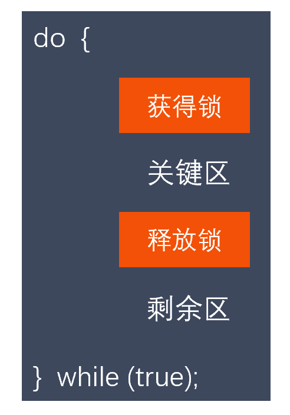
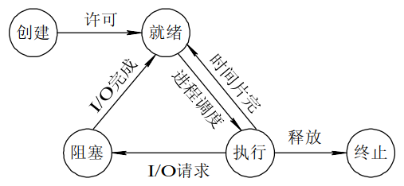
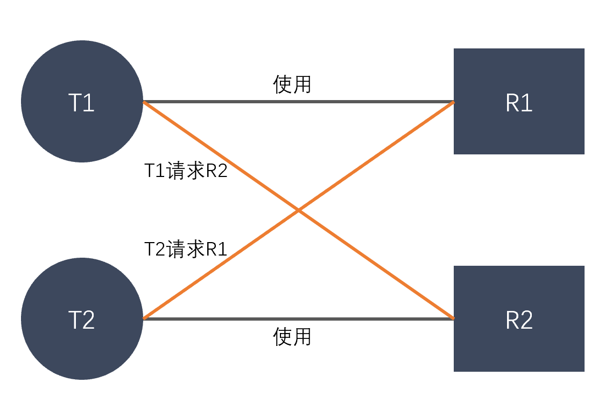
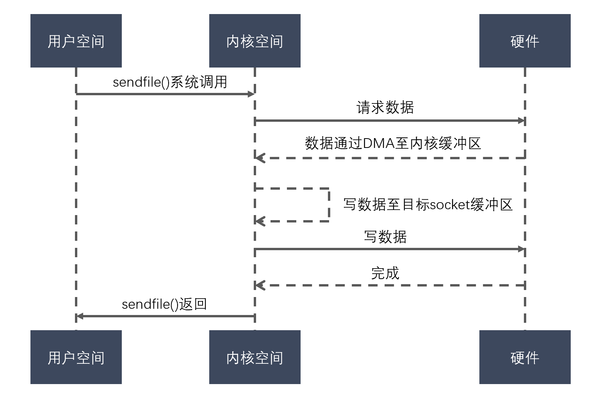
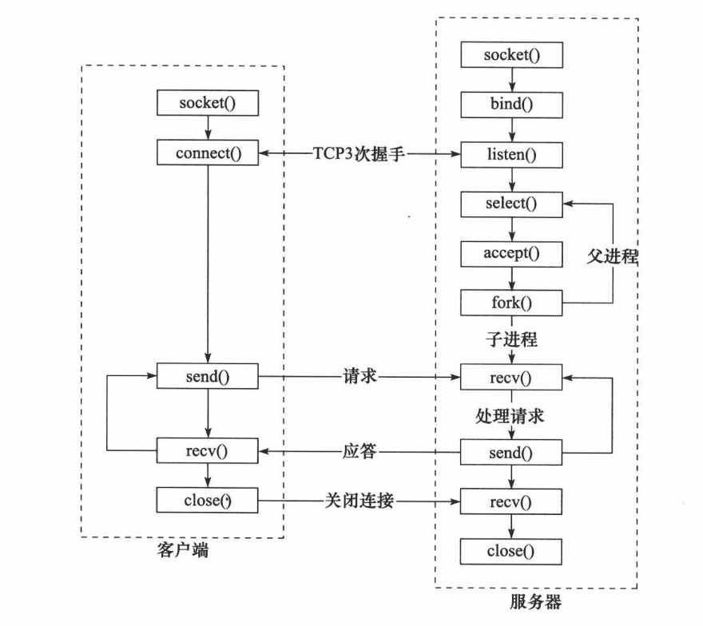

### 2.41 单核机器上写多线程程序，是否要考虑加锁，为什么？

**参考回答**

在单核机器上写多线程程序，仍然需要线程锁。

**原因**：因为线程锁通常用来实现线程的同步和通信。在单核机器上的多线程程序，仍然存在线程同步的问题。因为在抢占式操作系统中，通常为每个线程分配一个时间片，当某个线程时间片耗尽时，操作系统会将其挂起，然后运行另一个线程。如果这两个线程共享某些数据，**不使用线程锁的前提下，可能会导致共享数据修改引起冲突。**

### 2.42 说说多线程和多进程的不同？

**参考回答**

（1）一个线程从属于一个进程；一个进程可以包含多个线程。

（2）一个线程挂掉，对应的进程挂掉，多线程也挂掉；一个进程挂掉，不会影响其他进程，多进程稳定。

（3）进程系统开销显著大于线程开销；线程需要的系统资源更少。

（4）多个进程在执行时拥有各自独立的内存单元，多个线程共享进程的内存，如代码段、数据段、扩展段；但每个线程拥有自己的栈段和寄存器组。

（5）多进程切换时需要刷新TLB并获取新的地址空间，然后切换硬件上下文和内核栈；多线程切换时只需要切换硬件上下文和内核栈。

（6）通信方式不一样。

（7）多进程适应于多核、多机分布；多线程适用于多核

### 2.43 简述互斥锁的机制，互斥锁与读写的区别？

**参考回答**

1. **互斥锁机制**：mutex，用于保证在任何时刻，都只能有一个线程访问该对象。当获取锁操作失败时，线程会进入睡眠，等待锁释放时被唤醒。

2. **互斥锁和读写锁**：

   （1） 读写锁区分读者和写者，而互斥锁不区分

   （2）互斥锁同一时间只允许一个线程访问该对象，无论读写；读写锁同一时间内只允许一个写者，但是允许多个读者同时读对象。

**答案解析**

**原理详解**：

互斥锁其实就是一个bool型变量，为true时表示锁可获取，为false时表示已上锁。这里说的是**互斥锁**，其实是泛指linux中所有的锁机制。

我们采用互斥锁保护临界区，从而防止竞争条件。也就是说，一个线程在进入临界区时应得到锁；它在退出临界区时释放锁。函数 acquire() 获取锁，而函数 release() 释放锁，如图 ：



每个互斥锁有一个布尔变量 available，它的值表示锁是否可用。如果锁是可用的，那么调用 acquire() 会成功，并且锁不再可用。当一个线程试图获取不可用的锁时，它会阻塞，直到锁被释放。

按如下定义 acquire()：

```
acquire() {     while (!available);     /* busy wait */     available = false; }
```

按如下定义release()：

```
release() {     available = true; }
```

### 2.44 说说什么是信号量，有什么作用？

**参考回答**

1. **概念**：信号量本质上是一个计数器，用于多进程对共享数据对象的读取，它主要是用来保护共享资源（信号量也属于临界资源），使得资源在一个时刻只有一个进程独享。

2. **原理**：由于信号量只能进行两种操作等待和发送信号，即P(sv)和V(sv)，具体的行为如下：

   （1）P(sv)操作：如果sv的值大于零，就给它减1；如果它的值为零，就挂起该进程的执行（信号量的值为正，进程获得该资源的使用权，进程将信号量减1，表示它使用了一个资源单位）。

   （2）V(sv)操作：如果有其他进程因等待sv而被挂起，就让它恢复运行，如果没有进程因等待sv而挂起，就给它加1（若此时信号量的值为0，则进程进入挂起状态，直到信号量的值大于0，若进程被唤醒则返回至第一步）。

3. **作用**：用于多进程对共享数据对象的读取，它主要是用来保护共享资源（信号量也属于临界资源），使得资源在一个时刻只有一个进程独享。

### 2.45 进程、线程的中断切换的过程是怎样的？

**参考回答**

上下文切换指的是内核（操作系统的核心）在CPU上对进程或者线程进行切换。

1. **进程上下文切换**

   （1）保护被中断进程的处理器现场信息

   （2）修改被中断进程的进程控制块有关信息，如进程状态等

   （3）把被中断进程的进程控制块加入有关队列

   （4）选择下一个占有处理器运行的进程

   （5）根据被选中进程设置操作系统用到的地址转换和存储保护信息

   ​    **切换页目录以使用新的地址空间**

   ​    **切换内核栈和硬件上下文（包括分配的内存，数据段，堆栈段等）**

   （6）根据被选中进程恢复处理器现场

2. **线程上下文切换**

   （1）保护被中断线程的处理器现场信息

   （2）修改被中断线程的线程控制块有关信息，如线程状态等

   （3）把被中断线程的线程控制块加入有关队列

   （4）选择下一个占有处理器运行的线程

   （5）根据被选中线程设置操作系统用到的存储保护信息

   ​    **切换内核栈和硬件上下文（切换堆栈，以及各寄存器）**

   （6）根据被选中线程恢复处理器现场

### 2.46 简述自旋锁和互斥锁的使用场景

**参考回答**

1. **互斥锁**用于临界区持锁时间比较长的操作，比如下面这些情况都可以考虑

（1）临界区有IO操作

（2）临界区代码复杂或者循环量大

（3）临界区竞争非常激烈

（4）单核处理器

1. **自旋锁就**主要用在临界区持锁时间非常短且CPU资源不紧张的情况下。

### 2.47 请你说说线程有哪些状态，相互之间怎么转换？

**参考回答**

类似进程，有以下五种状态：

1. **新建状态(New)**
2. **就绪状态(Runnable)**
3. **运行状态(Running)**
4. **阻塞状态(Blocked)**
5. **死亡状态(Dead)**

**转换方式如下**：

**创建状态** 一个应用程序从系统上启动，首先就是进入**创建状态**，获取系统资源。

**就绪状态** 在**创建状态**完成之后，线程已经准备好，处于**就绪状态**，但是还未获得处理器资源，无法运行。

**运行状态** 获取处理器资源，被系统调度，当具有时间片开始进入**运行状态**。如果线程的时间片用完了就进入**就绪状态**。

**阻塞状态** 在**运行状态**期间，如果进行了阻塞的操作，如耗时的I/O操作，此时线程暂时无法操作就进入到了**阻塞状态**，在这些操作完成后就进入**就绪状态**。等待再次获取处理器资源，被系统调度，当具有时间片就进入**运行状态**。

**终止状态** 线程结束或者被系统终止，进入**终止状态**

相互转换如图：



### 2.48 多线程和单线程有什么区别，多线程编程要注意什么，多线程加锁需要注意什么？

**参考回答**

1. **区别**：

   （1）多线程从属于一个进程，单线程也从属于一个进程；一个线程挂掉都会导致从属的进程挂掉。

   （2）一个进程里有多个线程，可以并发执行多个任务；一个进程里只有一个线程，就只能执行一个任务。

   （3）多线程并发执行多任务，需要切换内核栈与硬件上下文，有切换的开销；单线程不需要切换，没有切换的开销。

   （4）多线程并发执行多任务，需要考虑同步的问题；单线程不需要考虑同步的问题。

2. 多线程编程需要考虑**同步**的问题。线程间的同步方式包括**互斥锁、信号量、条件变量、读写锁**。

3. 多线程加锁，主要需要注意**死锁**的问题。破坏死锁的必要条件从而避免死锁。

**答案解析**

1. **死锁**: 是指多个进程在执行过程中，因争夺资源而造成了互相等待。此时系统产生了死锁。比如两只羊过独木桥，若两只羊互不相让，争着过桥，就产生死锁。

2. **产生的条件**：死锁发生有**四个必要条件**： （1）**互斥条件**：进程对所分配到的资源不允许其他进程访问，若其他进程访问，只能等待，直到进程使用完成后释放该资源；

   （2）**请求保持条件**：进程获得一定资源后，又对其他资源发出请求，但该资源被其他进程占有，此时请求阻塞，而且该进程不会释放自己已经占有的资源；

   （3）**不可剥夺条件**：进程已获得的资源，只能自己释放，不可剥夺；

   （4）**环路等待条件**：若干进程之间形成一种头尾相接的循环等待资源关系。

3. **如何解决**：

   （1）资源一次性分配，从而解决请求保持的问题

   （2）可剥夺资源：当进程新的资源未得到满足时，释放已有的资源；

   （3）资源有序分配：资源按序号递增，进程请求按递增请求，释放则相反。

**答案解析**

举个例子，比如：如果此时有两个线程T1和T2，它们分别占有R1和R2资源

此时，T1请求R2资源的同时，T2请求R1资源。

这个时候T2说：你把R1给我，我就给你R2

T1说：不行，你要先给我R2，我才能给你R1

那么就这样，死锁产生了。如下图：



### 2.49 说说sleep和wait的区别？

**参考回答**

1. **sleep**

   sleep是一个延时函数，让进程或线程进入休眠。休眠完毕后继续运行。

   在linux下面，sleep函数的参数是秒，而windows下面sleep的函数参数是毫秒。

   windows下面sleep的函数参数是毫秒。

   例如：

   ```
   #include <windows.h>// 首先应该先导入头文件 Sleep (500) ; //注意第一个字母是大写。 //就是到这里停半秒，然后继续向下执行。
   ```

   在 Linux C语言中 sleep的单位是秒

   例如：

   ```
   #include <unistd.h>// 首先应该先导入头文件 sleep(5); //停5秒 //就是到这里停5秒，然后继续向下执行。
   ```

2. **wait**

   wait是父进程回收子进程PCB资源的一个系统调用。进程一旦调用了wait函数，就立即阻塞自己本身，然后由wait函数自动分析当前进程的某个子进程是否已经退出，当找到一个已经变成僵尸的子进程，wait就会收集这个子进程的信息，并把它彻底销毁后返回；如果没有找到这样一个子进程，wait就会一直阻塞，直到有一个出现为止。函数原型如下：

   ```
   #include<sys/types.h>   #include<sys/wait.h>     pid_t wait(int* status);  
   ```

   子进程的结束状态值会由参数status返回，而子进程的进程识别码也会一起返回。如果不需要结束状态值，则参数status可以设成 NULL。

3. **区别**： （1）sleep是一个延时函数，让进程或线程进入休眠。休眠完毕后继续运行。

   （2）wait是父进程回收子进程PCB（Process Control Block）资源的一个系统调用。

### 2.50 说说线程池的设计思路，线程池中线程的数量由什么确定？

**参考回答**

1. **设计思路**：

   实现线程池有以下几个步骤： （1）设置一个生产者消费者队列，作为临界资源。

   （2）初始化n个线程，并让其运行起来，加锁去队列里取任务运行

   （3）当任务队列为空时，所有线程阻塞。

   （4）当生产者队列来了一个任务后，先对队列加锁，把任务挂到队列上，然后使用条件变量去通知阻塞中的一个线程来处理。

2. **线程池中线程数量**：

   线程数量和哪些因素有关：CPU，IO、并行、并发

   ```
   如果是CPU密集型应用，则线程池大小设置为：CPU数目+1 如果是IO密集型应用，则线程池大小设置为：2*CPU数目+1 最佳线程数目 = （线程等待时间与线程CPU时间之比 + 1）* CPU数目
   ```

   所以线程等待时间所占比例越高，需要越多线程。线程CPU时间所占比例越高，需要越少线程。

**答案解析**

1. **为什么要创建线程池**：

   创建线程和销毁线程的花销是比较大的，这些时间有可能比处理业务的时间还要长。这样频繁的创建线程和销毁线程，再加上业务工作线程，消耗系统资源的时间，可能导致系统资源不足。**同时线程池也是为了提升系统效率。**

2. **线程池的核心线程与普通线程：**

   任务队列可以存放100个任务，此时为空，线程池里有10个核心线程，若突然来了10个任务，那么刚好10个核心线程直接处理；若又来了90个任务，此时核心线程来不及处理，那么有80个任务先入队列，再创建核心线程处理任务；若又来了120个任务，此时任务队列已满，不得已，就得创建20个普通线程来处理多余的任务。 **以上是线程池的工作流程。**

### 2.51 进程和线程相比，为什么慢？

**参考回答**

1. 进程系统开销显著大于线程开销；线程需要的系统资源更少。
2. 进程切换开销比线程大。多进程切换时需要刷新TLB并获取新的地址空间，然后切换硬件上下文和内核栈；多线程切换时只需要切换硬件上下文和内核栈。
3. 进程通信比线程通信开销大。进程通信需要借助管道、队列、共享内存，需要额外申请空间，通信繁琐；而线程共享进程的内存，如代码段、数据段、扩展段，通信快捷简单，同步开销更小。

### 2.52 简述Linux零拷贝的原理？

**参考回答**

1. **什么是零拷贝**：

   所谓「零拷贝」描述的是计算机操作系统当中，CPU不执行将数据从一个内存区域，拷贝到另外一个内存区域的任务。通过网络传输文件时，这样通常可以节省 CPU 周期和内存带宽。

2. **零拷贝的好处**：

   （1）节省了 CPU 周期，空出的 CPU 可以完成更多其他的任务

   （2）减少了内存区域之间数据拷贝，节省内存带宽

   （3）减少用户态和内核态之间数据拷贝，提升数据传输效率

   （4）应用零拷贝技术，减少用户态和内核态之间的上下文切换

3. **零拷贝原理**：

   在传统 IO 中，用户态空间与内核态空间之间的复制是完全不必要的，因为用户态空间仅仅起到了一种数据转存媒介的作用，除此之外没有做任何事情。

   **（1）Linux 提供了 sendfile() 用来减少我们的数据拷贝和上下文切换次数。**

   过程如图：

   

   a. 发起 sendfile() 系统调用，操作系统由用户态空间切换到内核态空间（第一次上下文切换）

   b. 通过 DMA 引擎将数据从磁盘拷贝到内核态空间的输入的 socket 缓冲区中（第一次拷贝）

   c. 将数据从内核空间拷贝到与之关联的 socket 缓冲区（第二次拷贝）

   d. 将 socket 缓冲区的数据拷贝到协议引擎中（第三次拷贝）

   e. sendfile() 系统调用结束，操作系统由用户态空间切换到内核态空间（第二次上下文切换）

   根据以上过程，一共有 2 次的上下文切换，3 次的 I/O 拷贝。我们看到从用户空间到内核空间并没有出现数据拷贝，**从操作系统角度来看，这个就是零拷贝**。内核空间出现了复制的原因: 通常的硬件在通过DMA访问时期望的是连续的内存空间。

   （2）**mmap 数据零拷贝原理**

   **如果需要对数据做操作，Linux 提供了mmap 零拷贝来实现。**

### 2.53 简述epoll和select的区别，epoll为什么高效？

**参考回答**

1. **区别**：

   （1）每次调用select，都需要把fd集合从用户态拷贝到内核态，这个开销在fd很多时会很大；而epoll保证了每个fd在整个过程中只会拷贝一次。

   （2）每次调用select都需要在内核遍历传递进来的所有fd；而epoll只需要轮询一次fd集合，同时查看就绪链表中有没有就绪的fd就可以了。

   （3）select支持的文件描述符数量太小了，默认是1024；而epoll没有这个限制，它所支持的fd上限是最大可以打开文件的数目，这个数字一般远大于2048。

2. **epoll为什么高效**：

   （1）select，poll实现需要自己不断轮询所有fd集合，直到设备就绪，期间可能要睡眠和唤醒多次交替。而epoll只要判断一下就绪链表是否为空就行了，这节省了大量的CPU时间。

   （2）select，poll每次调用都要把fd集合从用户态往内核态拷贝一次，并且要把当前进程往设备等待队列中挂一次，而epoll只要一次拷贝，而且把当前进程往等待队列上挂也只挂一次，这也能节省不少的开销。

### 2.54 说说多路IO复用技术有哪些，区别是什么？

**参考回答**

1. **select，poll，epoll**都是IO多路复用的机制，I/O多路复用就是通过一种机制，可以监视多个文件描述符，一旦某个文件描述符就绪（一般是读就绪或者写就绪），能够通知应用程序进行相应的读写操作。

2. **区别**：

   （1）poll与select不同，通过一个pollfd数组向内核传递需要关注的事件，故没有描述符个数的限制，pollfd中的events字段和revents分别用于标示关注的事件和发生的事件，故pollfd数组只需要被初始化一次。

   （2）select，poll实现需要自己不断轮询所有fd集合，直到设备就绪，期间可能要睡眠和唤醒多次交替。而epoll只要判断一下就绪链表是否为空就行了，这节省了大量的CPU时间。

   （3）select，poll每次调用都要把fd集合从用户态往内核态拷贝一次，并且要把当前进程往设备等待队列中挂一次，而epoll只要一次拷贝，而且把当前进程往等待队列上挂也只挂一次，这也能节省不少的开销。

### 2.55 简述socket中select，epoll的使用场景和区别，epoll水平触发与边缘触发的区别？

**参考回答**

1. **select，epoll的使用场景**：都是IO多路复用的机制，应用于高并发的网络编程的场景。I/O多路复用就是通过一种机制，可以监视多个文件描述符，一旦某个文件描述符就绪（一般是读就绪或者写就绪），能够通知应用程序进行相应的读写操作。

2. **select，epoll的区别**：

   （1）每次调用select，都需要把fd集合从用户态拷贝到内核态，这个开销在fd很多时会很大；而epoll保证了每个fd在整个过程中只会拷贝一次。

   （2）每次调用select都需要在内核遍历传递进来的所有fd；而epoll只需要轮询一次fd集合，同时查看就绪链表中有没有就绪的fd就可以了。

   （3）select支持的文件描述符数量太小了，默认是1024；而epoll没有这个限制，它所支持的fd上限是最大可以打开文件的数目，这个数字一般远大于2048。

3. **epoll水平触发与边缘触发的区别**

   LT模式（水平触发）下，只要这个fd还有数据可读，每次 epoll_wait都会返回它的事件，提醒用户程序去操作；

   而在ET（边缘触发）模式中，它只会提示一次，直到下次再有数据流入之前都不会再提示了，无论fd中是否还有数据可读。

### 2.56 说说Reactor、Proactor模式。

**参考回答**

在高性能的I/O设计中，有两个比较著名的模式Reactor和Proactor模式，其中**Reactor模式用于同步I/O**，而**Proactor运用于异步I/O**操作。

1. **Reactor模式**：Reactor模式应用于同步I/O的场景。Reactor中读操作的具体步骤如下：

   读取操作：

   （1）应用程序注册读就需事件和相关联的事件处理器

   （2）事件分离器等待事件的发生

   （3）当发生读就需事件的时候，事件分离器调用第一步注册的事件处理器

   （4）事件处理器首先执行实际的读取操作，然后根据读取到的内容进行进一步的处理

2. **Proactor模式**：Proactor模式应用于异步I/O的场景。Proactor中读操作的具体步骤如下：

   （1）应用程序初始化一个异步读取操作，然后注册相应的事件处理器，此时事件处理器不关注读取就绪事件，而是关注读取完成事件，这是区别于Reactor的关键。

   （2）事件分离器等待读取操作完成事件

   （3）在事件分离器等待读取操作完成的时候，操作系统调用内核线程完成读取操作，并将读取的内容放入用户传递过来的缓存区中。这也是区别于Reactor的一点，Proactor中，应用程序需要传递缓存区。

   （4）事件分离器捕获到读取完成事件后，激活应用程序注册的事件处理器，事件处理器直接从缓存区读取数据，而不需要进行实际的读取操作。

3. **区别**：从上面可以看出，Reactor中需要**应用程序自己读取或者写入数据**，而Proactor模式中，应用程序不需要用户再自己接收数据，直接使用就可以了，操作系统会将数据从**内核拷贝到用户区**。

**答案解析**

IO模型的类型。 （1）阻塞IO：调用者调用了某个函数，等待这个函数返回，期间什么也不做，不停的检查这个函数有没有返回，必须等这个函数返回后才能进行下一步动作。

（2）非阻塞IO：非阻塞等待，每隔一段时间就去检查IO事件是否就绪。没有就绪就可以做其他事情。

（3）信号驱动IO：Linux用套接口进行信号驱动IO，安装一个信号处理函数，进程继续运行并不阻塞，当IO事件就绪，进程收到SIGIO信号，然后处理IO事件。

（4）IO多路复用：Linux用select/poll函数实现IO复用模型，这两个函数也会使进程阻塞，但是和阻塞IO所不同的是这两个函数可以同时阻塞多个IO操作。而且可以同时对多个读操作、写操作的IO函数进行检查。知道有数据可读或可写时，才真正调用IO操作函数。

（5）异步IO：Linux中，可以调用aio_read函数告诉内核描述字缓冲区指针和缓冲区的大小、文件偏移及通知的方式，然后立即返回，当内核将数据拷贝到缓冲区后，再通知应用程序。用户可以直接去使用数据。

前四种模型--阻塞IO、非阻塞IO、多路复用IO和信号驱动IO都属于**同步模式**，因为其中真正的IO操作(函数)都将会阻塞进程，只有**异步IO模型**真正实现了IO操作的异步性。

### 2.57 简述同步与异步的区别，阻塞与非阻塞的区别？

**参考回答**

1. **同步与异步的区别**：

   **同步**：是所有的操作都做完，才返回给用户结果。即**写完数据库**之后，**再响应用户**，用户体验不好。

   **异步**：不用等所有操作都做完，就响应用户请求。即**先响应用户请求**，然后**慢慢去写数据库**，用户体验较好。

2. **阻塞与非阻塞的区别**：

   **阻塞**：调用者调用了某个函数，等待这个函数返回，期间什么也不做，不停的检查这个函数有没有返回，必须等这个函数返回后才能进行下一步动作。

   **非阻塞**：非阻塞等待，每隔一段时间就去检查IO事件是否就绪。没有就绪就可以做其他事情。

### 2.58 BIO、NIO有什么区别？

**参考回答**

**BIO（Blocking I/O）**：**阻塞IO**。调用者调用了某个函数，等待这个函数返回，期间什么也不做，不停的检查这个函数有没有返回，必须等这个函数返回后才能进行下一步动作。

**NIO（New I/O）**：**同时支持阻塞与非阻塞模式**，NIO的做法是叫一个线程不断的轮询每个IO的状态，看看是否有IO的状态发生了改变，从而进行下一步的操作。

### 2.59 请介绍一下5种IO模型

**参考回答**

1. 阻塞IO：调用者调用了某个函数，等待这个函数返回，期间什么也不做，不停的检查这个函数有没有返回，必须等这个函数返回后才能进行下一步动作。
2. 非阻塞IO：非阻塞等待，每隔一段时间就去检查IO事件是否就绪。没有就绪就可以做其他事情。
3. 信号驱动IO：Linux用套接口进行信号驱动IO，安装一个信号处理函数，进程继续运行并不阻塞，当IO事件就绪，进程收到SIGIO信号，然后处理IO事件。
4. IO多路复用：Linux用select/poll函数实现IO复用模型，这两个函数也会使进程阻塞，但是和阻塞IO所不同的是这两个函数可以同时阻塞多个IO操作。而且可以同时对多个读操作、写操作的IO函数进行检查。知道有数据可读或可写时，才真正调用IO操作函数。
5. 异步IO：Linux中，可以调用aio_read函数告诉内核描述字缓冲区指针和缓冲区的大小、文件偏移及通知的方式，然后立即返回，当内核将数据拷贝到缓冲区后，再通知应用程序。用户可以直接去使用数据。

**答案解析**

前四种模型--阻塞IO、非阻塞IO、多路复用IO和信号驱动IO都属于**同步模式**，因为其中真正的IO操作(函数)都将会阻塞进程，只有**异步IO模型**真正实现了IO操作的异步性。

**异步和同步的区别就在于**，异步是内核将数据拷贝到用户区，不需要用户再自己接收数据，直接使用就可以了，而同步是内核通知用户数据到了，然后用户自己调用相应函数去接收数据。

### 2.60 请说一下socket网络编程中客户端和服务端用到哪些函数？

**参考回答**

1. **服务器端函数**：

   （1）socket创建一个套接字

   （2）bind绑定ip和port

   （3）listen使套接字变为可以被动链接

   （4）accept等待客户端的链接

   （5）write/read接收发送数据

   （6）close关闭连接

2. **客户端函数**：

   （1）创建一个socket，用函数socket()

   （2）bind绑定ip和port

   （3）连接服务器，用函数connect()

   （4）收发数据，用函数send()和recv()，或read()和write()

   （5）close关闭连接

   

### 2.61 简述网络七层参考模型，每一层的作用？

**参考回答**

| OSI七层模型 | 功能                                                         | 对应的网络协议                                               | TCP/IP四层概念模型 |
| ----------- | ------------------------------------------------------------ | ------------------------------------------------------------ | :----------------: |
| 应用层      | 文件传输，文件管理，电子邮件的信息处理                       | HTTP、TFTP, FTP, NFS, WAIS、SMTP                             |       应用层       |
| 表示层      | 确保一个系统的应用层发送的消息可以被另一个系统的应用层读取，编码转换，数据解析，管理数据的解密和加密。 | Telnet, Rlogin, SNMP, Gopher                                 |       应用层       |
| 会话层      | 负责在网络中的两节点建立，维持和终止通信。                   | SMTP, DNS                                                    |       应用层       |
| 传输层      | 定义一些传输数据的协议和端口。                               | TCP, UDP                                                     |       传输层       |
| 网络层      | 控制子网的运行，如逻辑编址，分组传输，路由选择               | IP, ICMP, ARP, RARP, AKP, UUCP                               |       网络层       |
| 数据链路层  | 主要是对物理层传输的比特流包装，检测保证数据传输的可靠性，将物理层接收的数据进行MAC（媒体访问控制）地址的封装和解封装 | FDDI, Ethernet, Arpanet, PDN, SLIP, PPP，STP。HDLC,SDLC,帧中继 |     数据链路层     |
| 物理层      | 定义物理设备的标准，主要对物理连接方式，电气特性，机械特性等制定统一标准。 | IEEE 802.1A, IEEE 802.2到IEEE 802.                           |     数据链路层     |