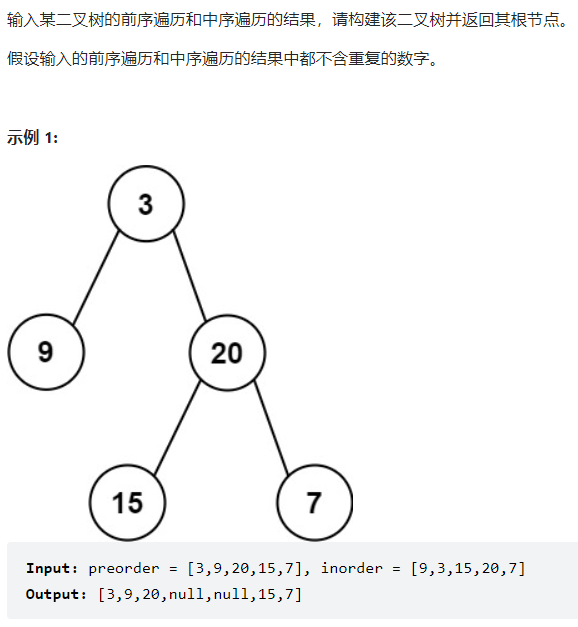
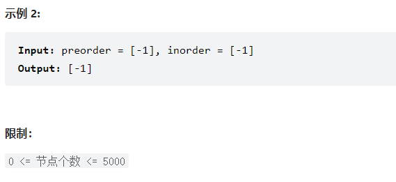

## 题目：





## 解题思路：

1. 从前序中获取根节点`preorder[0]`;
2. 在后序列表中查询根节点的位置`i`
3. 在后序序列中，`0 ~ i-1`是左子树；`i-1 ~ inorder.size()-1`是右子树
4. 根据上述步骤递归创建左子树和右子树

```c++
#include <iostream>
#include <vector>
using namespace std;

  struct TreeNode {
      int val;
      TreeNode *left;
      TreeNode *right;
      TreeNode(int x) : val(x), left(NULL), right(NULL) {}
  };
 
class Solution {
public:
    TreeNode* buildTree(vector<int>& preorder, int pref, vector<int>& inorder, int inf, int length) {
        TreeNode* head = new TreeNode(preorder[pref]);
        if (length == 1) {
            return head;
        }
        int i = inf;
        for (i; i < inf + length && inorder[i] != preorder[pref]; i++);
        int leftNum = i - inf ;// 加一问题
        int rightNum = length - leftNum - 1;
        if (leftNum > 0) {
            head->left = buildTree(preorder, pref + 1, inorder, inf, leftNum);
        }
        if (rightNum > 0) {
            head->right = buildTree(preorder, pref + leftNum + 1, inorder, i + 1, rightNum);
        }
        return head;
    }
    TreeNode* buildTree(vector<int>& preorder, vector<int>& inorder) {

        if (preorder.size() == 0) {
            return nullptr;
        }
        if (preorder.size() == 1) {
            TreeNode* head = new TreeNode(preorder[0]);
            return head;
        }

        //根节点为前序的第一个节点
        TreeNode* head = new TreeNode(preorder[0]);
        
        int length = inorder.size();
        int i = 0;
        for (; i < length && inorder[i] != preorder[0]; i++);
        int leftNum = i;
        int rightNum = length - i - 1;
        if (leftNum > 0) {
            head->left = buildTree(preorder, 1, inorder, 0, leftNum);
        }
        if (rightNum > 0) {
            head->right = buildTree(preorder, i + 1, inorder, i + 1, rightNum);
        }
        return head;
    }
};
int main() {
    Solution s;
    vector<int> preorder = { 3,9,20,15,7 };
    vector<int> inorder = { 9,3,15,20,7 };
    TreeNode *head = s.buildTree(preorder, inorder);
    vector<TreeNode*> printV;
    if (head != nullptr) {
        printV.push_back(head);
    }
    int i = 0;
    while (i < printV.size()) {
        if (printV[i] != nullptr) {
            cout << printV[i]->val << "\t";
        }
        else {
            cout << "null" << "\t";
        }
        if (printV[i] != nullptr) {
            if (printV[i]->left != nullptr) {
                printV.push_back(printV[i]->left);
            }
            else {
                printV.push_back(nullptr);
            }
            if (printV[i]->right != nullptr) {
                printV.push_back(printV[i]->right);
            }
            else {
                printV.push_back(nullptr);
            }
        }
        
        i++;
    }
    return 0;
}

```

优化：用指针索引

```c++
class Solution {
public:
    //使用指针索引
    TreeNode* buildTree(int * prestart,int* preend, int * instart, int* inend) {
        //是否存在子树
        TreeNode * head = new TreeNode(*prestart);
        if (preend == prestart) {
            return head;
        }
        //查找根节点在中序中的位置
        int* root = instart;
        while (*(root) != *prestart) {
            root++;
        }

        int leftNum = root - instart;//左子树的个数
        if (leftNum > 0) {//存在左子树
            int* instart_n = instart;
            int* inend_n = root - 1;
            int* prestart_n = prestart + 1;
            int* preend_n = prestart_n + leftNum - 1;
            head->left = buildTree( prestart_n, preend_n, instart_n, inend_n );//参数写反了，所以第一遍报错 
        }
        int rightNum = inend - root;
        if (rightNum > 0) {//存在右子树
            int* instart_n = root+1;
            int* inend_n = inend;
            int* prestart_n = prestart+leftNum+1;
            int* preend_n = preend;
            head->right = buildTree( prestart_n, preend_n, instart_n, inend_n);//参数写反了，所以第一遍报错
        }
        return head;
        
    }
    TreeNode* buildTree(vector<int>& preorder, vector<int>& inorder) {
        if (preorder.size() == 0)return nullptr;
        if (preorder.size() == 1)return new TreeNode(preorder[0]);

        int* prestart = &preorder[0];
        int* instart = &inorder[0];
        int end = preorder.size()-1;
        int* preend = &preorder[end];
        int* inend = &inorder[end];
        return buildTree(prestart, preend, instart, inend);
    }
};
```

