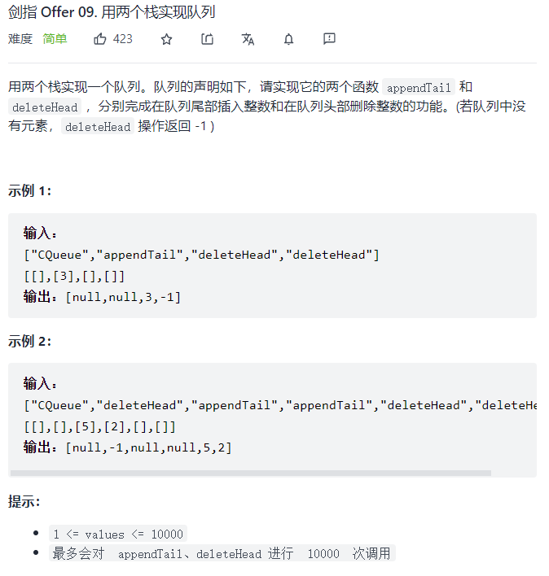

题目：



解题思路:

首先我们需要知道队列和栈的特点：

+ 队列：先进先出、后进后出
+ 栈：先进后出、后进先出

所以，我们可以通过下列过程：

1. 元素依次进入第一个栈
2. 元素依次退出第一个栈同时依次进入第二个栈
3. 元素依次退出第二个栈

达到队列先进先出的效果。

代码：

```java
class CQueue {

    int[] zhan1 = new int[1000];int top1 = -1;
    int[] zhan2 = new int[1000];int top2 = -1;
    
    public CQueue() {
    }
    
    public void appendTail(int value) {
        //如果栈一未满就执行进栈操作
        if (top1 < 999){
            zhan1[++top1] = value;
        }
        //如果栈二为空，将栈一中元素转移至栈二中
        if (top2 == -1){
            while(top1 > -1){
                zhan2[++top2] = zhan1[top1--];
            }
        }
    }
    
    public int deleteHead() {
        //如果栈二非空，执行退栈操作
        if (top2 != -1){
            return zhan2[top2--];
        }
        //如果栈二为空且栈一非空，将栈一元素转移至栈二中，执行退栈操作
        else if(top2 == -1 && top1 != -1){
            while(top1 > -1){
                zhan2[++top2] = zhan1[top1--];
            }
            return zhan2[top2--];
        }
        //栈一、栈二皆为空，返回-1
        else{
            return -1;
        }
    }
}
```


解题：

入队操作：

将元素压入stack1

出队操作：

+ 如果stack2不空，stack2栈顶元素出栈

+ 如果stack2为空，stack1元素挨个出栈，并压入stack2

  stack1为空后,stack2栈顶元素出栈

```c++
class Solution {
  public:
    void push(int node) {
        stack1.push(node);
    }

    int pop() {
        if (stack2.size() == 0) {
            while (!stack1.empty()) {
                stack2.push(stack1.top());
                stack1.pop();
            }
        }
        int res = stack2.top();
        stack2.pop();
        return res;
    }

  private:
    stack<int> stack1;
    stack<int> stack2;
};
```

> 注意事项：
>
> 关于C++栈的方法需要掌握
>
> 常用方法：
>
> `push()`、`top()`、`pop()`、`empty()`


额外题目：两个队列实现一个栈
