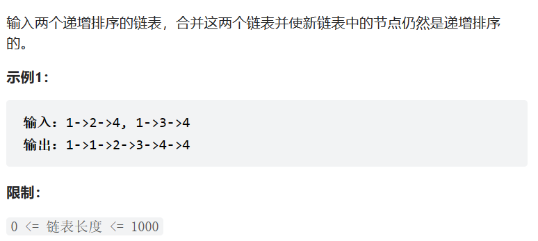

题目：



思路：

1. 新建一个链表，两个指针按位遍历，数值小的插入前移
2. 将一条链以插入排序的方式插入到另一条链中

这里选择思路二

具体流程：将`l2`插入到`l1`中

1. 两个指针指向两条链表，`p = l1;q = l2`

2. 比较`p`和`q`的值

   + 如果`q->val <= p->val`，`q`需要插入到`p`前

   + 否则，`q`需要插入到`p`后

3. `q`插入到`p`前的操作

   由于链表都是有序的，所以后一个节点值大于前一个节点值，所以，如果`q->val <= p->val`，则插入位置为`p`的前一位

   1. 由于，在`p`还指向`l1`时，前插只需要将新节点的`next`指向`p`，同时需要前移头结点`l1 = Temp`

   2. 之后，`l1`指向新的头结点，而`p`还保留在原来的位置，后续插入则需要`p`前一个节点的指针`l1_be`。新节点的`next`依旧指向`p`，`p`前一个节点的指针的`next`需要指向新节点

4. `q`插入到`p`后的操作

   1. 比较`p->next->val`，`q->val`，`p`向后偏移，直到第一个大于等于`q->val`的值
   2. 将`q`插入到`p`后，`q = q->next`

5. 如果`p->next ==NULL`，则依次将`q`插入到`p`后

6. 重复上述3、4、5过程直到`q = NULL`

代码：

```java
#include <iostream>
using namespace std;

struct ListNode {
    int val;
    ListNode* next;
    ListNode(int x) : val(x), next(NULL) {}
};

ListNode* mergeTwoLists(ListNode* l1, ListNode* l2) {
    if (l1 == NULL) {
        return l2;
    }
    if (l2 == NULL) {
        return l1;
    }
    ListNode* p = l1;
    ListNode* q = l2;
    //头结点前插入
    while (q != NULL && q->val <= p->val) {
        ListNode* Temp = new ListNode(q->val);
        ListNode* l1_be;
        Temp->next = p;
        if (p == l1) {
            l1 = Temp;
            l1_be = Temp;
        }
        else {
            l1_be->next = Temp;
            l1_be = Temp;
        }
        q = q->next;
    }
    //头结点后插入
    while (q != NULL) {
        //找到第一个比q->val大或者相等的p->next
        while (p->next != NULL && q->val > p->next->val) {
            p = p->next;
        }
        if (p->next == NULL) {
            cout << q->val << endl;
            while (q != NULL) {
                ListNode* Temp = new ListNode(q->val);
                p->next = Temp;
                q = q->next;
                p = p->next;
            }
            p->next = NULL;
            return l1;
        }
        else {
            
            ListNode* Temp = new ListNode(q->val);
            Temp->next = p->next;
            p->next = Temp;
            q = q->next;
            p = p->next;
        }
    }
    return l1;
}
```

```C++

```
