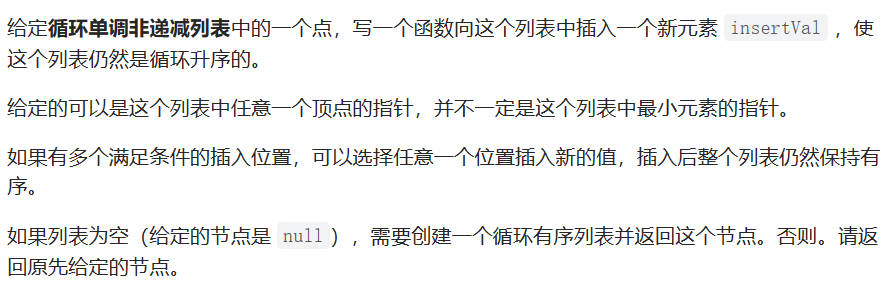
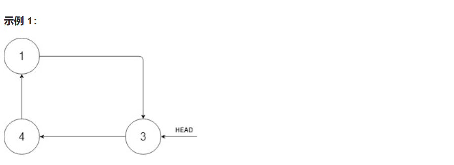
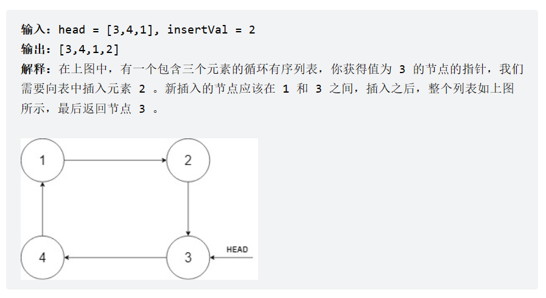
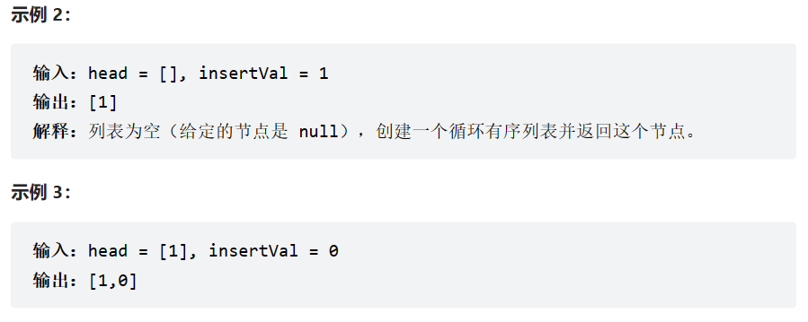
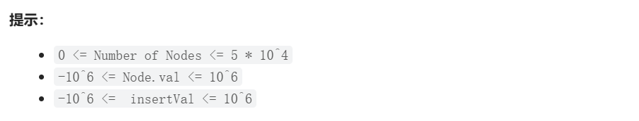

题目：











思路：

使用两个指针，一个指针p指向当前节点，一个指针q指向下一个节点

1. 判断链表是否为空

   1. 空，新建循环有序链表，返回这个节点
   2. 非空，下一步

2. 寻找插入位置

   + 循环连接处——所给定节点值为新的最值，前一个节点为原最大值，后一个节点为原最小值

   + 非循环连接处——前一个节点小于给定节点值，后一个节点大于给定节点值

   1. 比较给定节点值和头节点值
      + 给定节点值大于等于头结点：
        + (p < q)向后遍历寻找第一个大于等于给定节点的节点
        + (p > q)给定节点值为最大值
      + 给定节点值小于头结点：
        + 找到最小节点，比较给定节点和最小节点
        + (给定节点小于最小节点)插入位置为循环连接处
        + (给定节点大于最小节点)向后遍历寻找第一个大于等于给定节点的节点

3. 插入节点

代码：

```c++
#include<iostream>
using namespace std;


// Definition for a Node.
class Node {
public:
    int val;
    Node* next;

    Node() {}

    Node(int _val) {
        val = _val;
        next = NULL;
    }

    Node(int _val, Node* _next) {
        val = _val;
        next = _next;
    }
};

Node* insert(Node* head, int insertVal) {
    Node* cur = head;

    //1. 判空
    if (head == NULL) {
        Node * insertNode =  new Node(insertVal);
        insertNode->next = insertNode;
        return insertNode;
    }

    //2. 只有一个节点
    if (head->next == head) {
        Node* insertNode = new Node(insertVal, cur->next);
        cur->next = insertNode;
        return head;
    }

    //3. 判断当前节点与给定节点值的大小
    if ( insertVal >= head->val) {
        while (cur->next->val < insertVal && cur->next->val >= cur->val && cur ->next !=head) {
            cur = cur->next;
        }
        Node* insertNode = new Node(insertVal, cur->next);
        cur->next = insertNode;
        return head;
    }
    else{
        //找到最小节点，为cur->next
        while(cur->next->val > insertVal && cur->next->val >= cur->val && cur->next != head){
            cur = cur->next;
        }
        if (cur->next->val >= insertVal) { // insertVal为最小值
            Node* insertNode = new Node(insertVal, cur->next);
            cur->next = insertNode;
            return head;
        }
        else {
            while (cur->next->val < insertVal) {
                cur = cur->next;
            }
            Node* insertNode = new Node(insertVal, cur->next);
            cur->next = insertNode;
            return head;
        }
    }
}
```

过程中出现错误：

1. 忽视了相等节点的情况

2. 知道有链表中节点值相等的情况后，循环遍历需要增加遇到相等节点的情况

   指的是在遍历寻找节点插入位置和最小节点的两次循环

