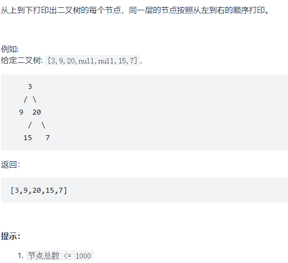

题目：



解题思路：

按层遍历流程：

1. 创建一个队列
2. 将根节点入队
3. 根节点出队
4. 判断根节点是否有左右子节点
5. 然后循环上述流程

代码：

1、迭代——静态数组

```
    public int[] levelOrder(TreeNode root) {
        // 对于空树
        if(root == null) {
            int [] nodeVals = new int []{};
            return nodeVals;
        }

        //队列
        TreeNode [] nodes = new TreeNode[1000];
        int fir = 0;
        int las = -1;
        //返回数据
        int [] nodeVals = new int[1000];
        int i = 0;

        TreeNode node = root;
        nodes[++las] = node;
        int countNums = 0;
        while(fir <= las){
            //出队
            countNums++; //计算输出的节点个数
            node = nodes[fir];
            nodeVals[i++] = nodes[fir].val;
            fir++;
            //子孙入队
            if (node.left!=null) nodes[++las] = node.left;
            if (node.right != null) nodes[++las] = node.right;
        }
        int [] nodeValsNew = new int[countNums];
        for (int j=0; j<countNums; j++) nodeValsNew[j] = nodeVals[j];
        return nodeValsNew;
    }
```

  2、迭代——动态数组

```
    public int[] levelOrder(TreeNode root) {
        // 对于空树
        if(root == null)
            return new int []{};

        //队列
        TreeNode [] nodes = new TreeNode[1000];
        int fir = 0;
        int las = -1;

        //返回值
        ArrayList<Integer> nodeVals = new ArrayList<>();

        TreeNode node = root;
        nodes[++las] = node;
        while(fir <= las){
            //出队
            node = nodes[fir];
            nodeVals.add(nodes[fir].val);
            fir++;
            //子孙入队
            if (node.left!=null)
                nodes[++las] = node.left;
            if (node.right != null)
                nodes[++las] = node.right;
        }

        int [] nodeValsNew = new int[nodeVals.size()];
        for(int i = 0;i<nodeVals.size();i++)
            nodeValsNew[i] = nodeVals.get(i);
        return nodeValsNew;
    }
```

3、递归

```

```

