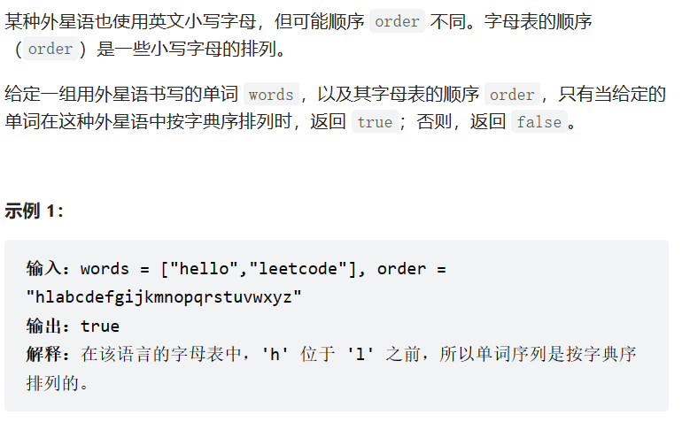
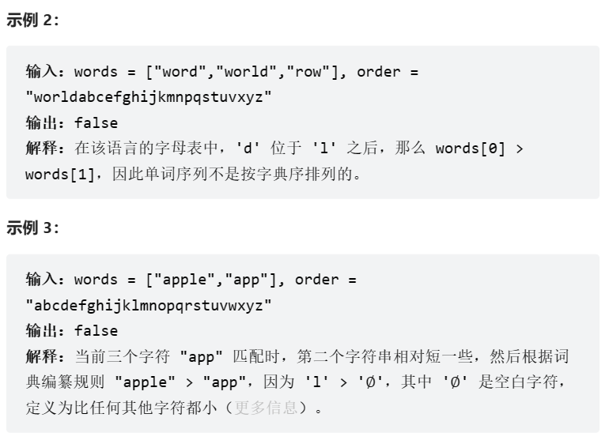
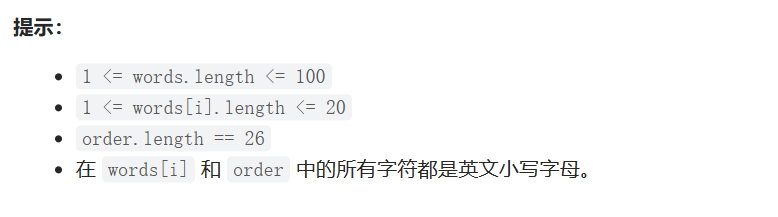

题目：







思路：

思路一：words进行基数排序，如果需要交换，则返回false

思路二：对words中相邻单词两两比较

1. 设置比较器comparabyme(string s1,strings2, stirng order)

   + 参数列表：

     + s1：words[i]

     + s2：words[i+1]

     + order：比较规则

   + 返回值：bool，二者是否符合字典排序规则

2. 顺序遍历words，其中只要有一对是false就返回false，所有都通过后，最后返回true

采用思路二：

```java
#include <iostream>
#include <vector>
#include <string>
#include <map>
using namespace std;
bool comparabyme(string s1, string s2, string order) {
	int lenOfTwo;
	bool bef;
	if (s1.size() <= s2.size()) {
		lenOfTwo = s1.size();
		bef = 1;
	}
	else {
		lenOfTwo = s2.size();
		bef = 0;
	}
	for (int i = 0; i < lenOfTwo; i++) {
		if (s1[i] != s2[i]) {
			int a = order.find(s1[i]);
			int b = order.find(s2[i]);
			
			if (a > b)return false;
			else return true;
		}
	}
	if (bef) return true;
	else return false;
}

bool isAlienSorted(vector<string>& words, string order) {

	for (int i = 0; i < words.size() - 1; i++) {
		if (!comparabyme(words[i],words[i+1],order)) {
			return false;
		}
	}

	return true;
}

```

> 字典排序规则：
>
> + 两个单词，在短单词的长度范围内，对应字母都相同，短单词排前面
> + 两个单词，在短单词的长度范围内，对应字母不同，对应字母在排序规则中靠前的单词排前面
> + 两个单词相同时，怎么排都行

总结：在针对这种算法题前，需要将可能的结果排列出来...