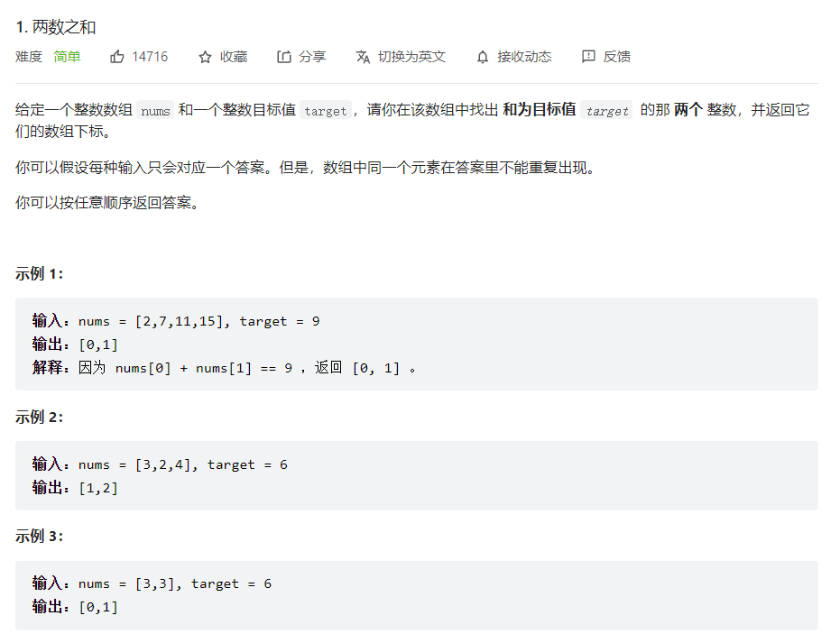

# 两数之和

题目：<https://leetcode.cn/problems/two-sum/submissions/>




## 解题思路

使用哈希表，has = <key, value>

+ key 对应的`nums[i]`
+ value 对应的`i`

1. 查找has中是否存在`target - nums[i]`

    > + 存在，找到结果，返回`{has[target - nums[i]], i}`
    > + 不存在，继续找下一个

2. 将<nums[i], i>存入哈希表

## 代码

```c++
vector<int> twoSum(vector<int>& nums, int target) {
    unordered_map<int , int> has;
    int n = nums.size() - 1;
    for(int i = 0; i < n; ++i){
        if(has.find(target - nums[i]) != has.end()){
            return {nums[i], target - nums[i]};
        }
        has[nums[i]] = i;
    }
    return {};
}

```