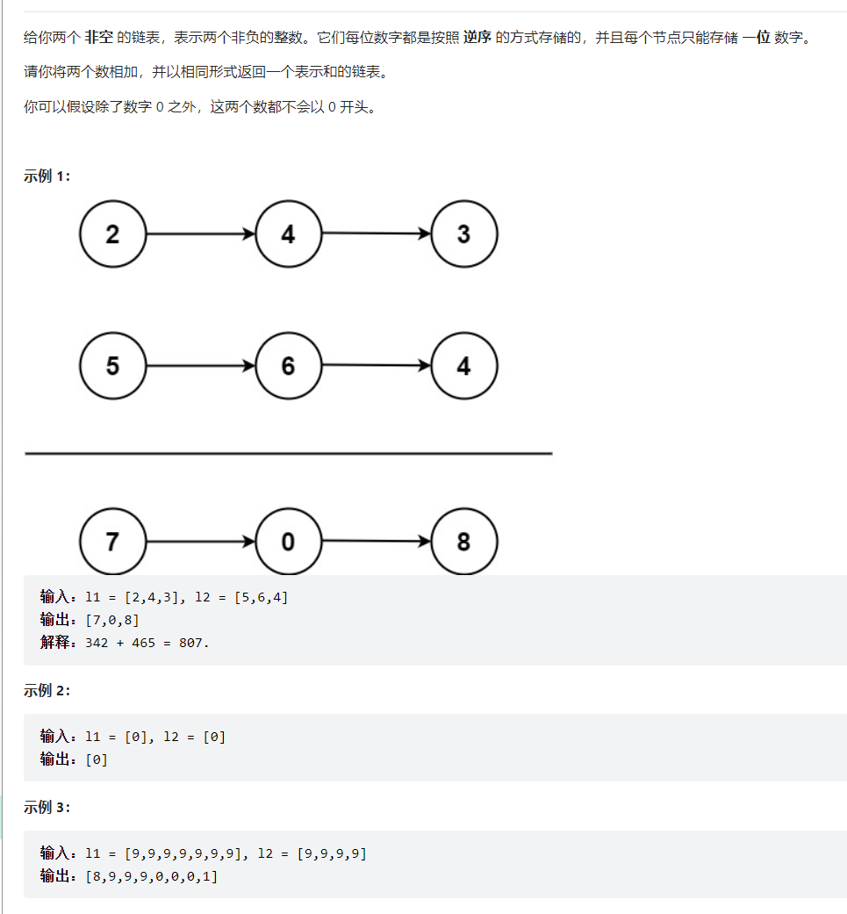

题目：




代码：

```java
public static class ListNode {
        int val;
        ListNode next;
        ListNode() {}
        ListNode(int val) { this.val = val; }
        ListNode(int val, ListNode next) { this.val = val; this.next = next; }
    }
    public ListNode TwoNumsSum(ListNode l1, ListNode l2){
        //排除特殊情况
        if(l1==null && l2==null) return null;
        if(l1==null) return l2;
        if(l2==null) return l1;
//        创建指针;
        ListNode node1 = l1;
        ListNode node2 = l2;
//        计算两个链表的长度
        int lengthOfL1 = FindLength(l1);
        int lengthOfL2 = FindLength(l2);
//        确定结果用哪个链表保存
        ListNode result = lengthOfL1>lengthOfL2?l1:l2;
        ListNode res = result;
        //res前一位
        ListNode resBef = new ListNode();
        resBef.next = res;
//        确定循环次数
        int shortLength = Math.min(lengthOfL1, lengthOfL2);
        int longLength = Math.max(lengthOfL1, lengthOfL2);
        int tempJin = 0;//进位数据保存
        int i = 0;
        // node1.val+ node2.val+ tempJin
        while (i<shortLength){
            int temp = node1.val+ node2.val+ tempJin;
            if (temp>=10){
                tempJin = 1;
                res.val = temp - 10;
            }else{
                tempJin = 0;
                res.val = temp;
            }
            i++;
            node1 = node1.next;
            node2 = node2.next;
            res = res.next;
            resBef = resBef.next;
        }
        // res.val+ tempjin
        while(i<longLength && tempJin==1){
            int temp = res.val +tempJin;
            if (temp>=10){
                res.val = temp - 10;
            }else{
                tempJin = 0;
                res.val = temp;
            }
            i++;
            res = res.next;
            resBef = resBef.next;
        }
        //最后一位
        if (tempJin == 1 && res == null){
            ListNode newNode = new ListNode(1);
            newNode.next = null;
            resBef.next = newNode;
        }
        return result;
    }
//计算链表长度
    public static int FindLength(ListNode l){
        int res = 0;
        ListNode node = l;
        while (node!=null){
            res++;
            node = node.next;
        }
        return res;
    }
```