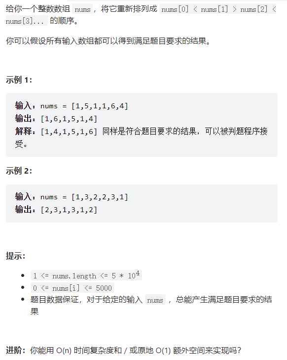

# 摆动排序二

## 题目：

## 解题思路：

**1，判断数组是否能够变成摆动序列**

根据题意，数组希望变成的形式为
$$
nums[0] < nums[1] > nums[2] <nums[3]...
$$
也就是说，相同元素不能相邻。在摇摆序列中，相同元素最多的情况下摆放的位置为：从第0位，每隔一个位置摆放，一直到数组结束。所以相同元素的个数$counts$需要满足
$$
counts <= (nums.length + 1) / 2
$$
**2，摆放方法一**

将数组按从小到大排序，