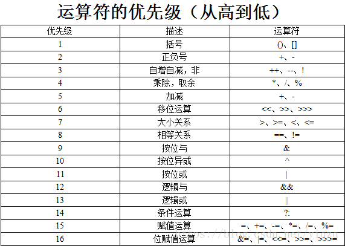

# 两整数之和

题目：<https://leetcode.cn/problems/sum-of-two-integers/>

## 解题思路

使用位运算

+ 使用XOR运算判断当前这一位是否为1
+ 使用与运算判断是否需要进一

## 代码

```c++
int getSum(int a, int b) {

    //通过异或运算得到本位
    //通过与运算得到进位
    //不断使 本位 与（进位<<1），做为相加数
    int temp;    
    while(b != 0){
        temp = a^b;
        //b = a & b << 1; // 运算符优先级错误
        //b = (a&b) << 1; // 左移负数报错
        //改正方法：使用更大的无符号整型
        b = (unsigned int) (a&b) << 1;
        a = temp;
    }
    return a;
}
```

递归写法：

```c++
int getSum(int a, int b) {
    return b == 0 ? a : getSum(a^b, (unsigned int)(a&b) << 1);
}
```

## 额外知识

### 1 位置运算符优先级



### 2 针对负数左移溢出报错的可能解决方法

计算时使用更大的无符号整型

结束后再改回来
