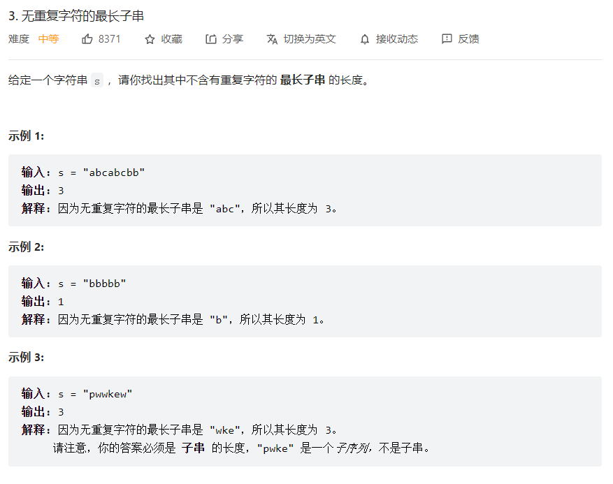

## 题目：




## 思路：

采用计数查询的方式，创建数组`charsNum[256]`，记录子串中字符的位置

通过`begin`变量来记录子串的初始位置

使用`length`变量记录不存在重复字符的子串的长度

使用`maxLength`变量保存最大子串长

使用循环，不断向后遍历，然后更新`begin`和`length`

### 代码：

```java
        int[] charsNum = new int[256];//计数查询;将字符在字符串中的位置保存
        for (int i = 0; i < 256; i++) {
            charsNum[i] = -1;
        }
        char [] chars = s.toCharArray();
        int maxLength = 0;//保存最长记录
        int length = 0;//保存当前无重复字符记录
        int begin = 0;//记录子字符串开始的位置
        int i = 0;
        while(i<s.length()){
            System.out.println(chars[i]);
            length++;
            //记录里没有字符——延伸当前子串
            if (charsNum[chars[i]] != -1 && charsNum[chars[i]]>=begin){//字符已记录——更新子串
                length -= charsNum[chars[i]] + 1 - begin;
                begin = charsNum[chars[i]] + 1;//正确
            }
            charsNum[chars[i]] = i;//更新记录;
            maxLength = Math.max(maxLength,length);
            i++;
        }
        return maxLength;
```

## 优化：

优化内容：将对字符串的遍历方式，由使用`s.toCharArray()`方法将字符串转变成数组，再进行查询的方式，改成使用`s.charAt(i)`直接对字符串进行查询。

### 代码：

```java
        int[] charsNum = new int[128];//计数查询;将字符在字符串中的位置保存
        for (int i = 0; i < 128; i++) {
            charsNum[i] = -1;
        }
        int maxLength = 0;//保存最长记录
        int length = 0;//保存当前无重复字符记录
        int begin = 0;//记录子字符串开始的位置
        int i = 0;
        while(i<s.length()){
            char curChar = s.charAt(i);
            length++;
            //记录里没有字符——延伸当前子串
            if (charsNum[curChar] != -1 && charsNum[curChar]>=begin){//字符已记录——更新子串
                length -= charsNum[curChar] + 1 - begin;
                begin = charsNum[curChar] + 1;//正确
            }
            charsNum[curChar] = i;//更新记录;
            maxLength = Math.max(maxLength,length);
            i++;
        }
        return maxLength;
```

