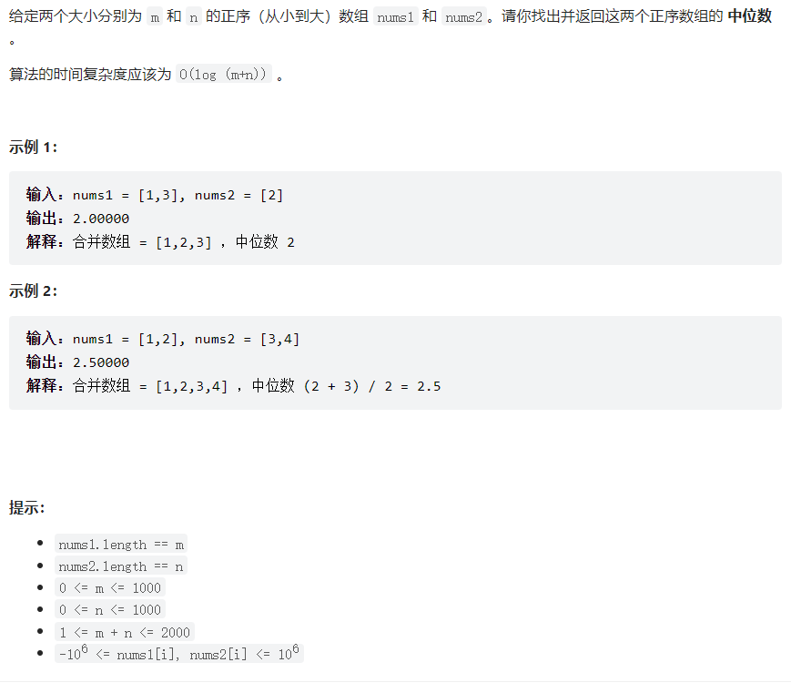

## 题目：



思路：

创建一个数组，遍历两个数组，并逐个添加

因为是正序数组，最后直接返回最中间的值即可

代码：

```java
    public static double findMedianSortedArrays(int[] nums1, int[] nums2) {
        //思路：由于两个数组都是正序数组，所以创建一个新数组将两个数组依次添加进去，最后得到一个新的正序数组，显而易见，中位数就是最中间的数了
        int[] nums3 = new int[nums1.length+nums2.length];
        int i=0,j=0,z=0;
        while(z< nums3.length){
            if (i<nums1.length && j< nums2.length){
                if (nums1[i] <= nums2[j]){
                    nums3[z++] = nums1[i++];
                }else{
                    nums3[z++] = nums2[j++];
                }
            }else if(i<nums1.length){
                nums3[z++] = nums1[i++];
            }else{
                nums3[z++] = nums2[j++];
            }
        }
        System.out.println(nums3.length);
        return nums3.length%2!=0? nums3[nums3.length / 2] :(nums3[nums3.length/2-1]+nums3[nums3.length/2])/2.0;
    }
```

时间复杂度为O（m+n）

优化算法：

因为两个数组有序，所以中位数的位置是显而易见的，所以只需要找到中位数位置上的数即可

```java
        int i = 0,j = 0,z = 0;//遍历指针
        int sumLen = nums1.length + nums2.length;
        int mindleLen = sumLen/2;//标志位
        int mindleL = 0,mindleR = 0;//中位数
        
        //确定mindleL的值
        while (z<mindleLen){
            if (i< nums1.length && j< nums2.length){
                if (nums1[i]<nums2[j]) mindleL = nums1[i++];
                else mindleL = nums2[j++];
            }
            else if (i< nums1.length) mindleL = nums1[i++];
            else if (j< nums2.length) mindleL = nums2[j++];
            z++;
        }
        
        //确定mindleR的值
        if (i< nums1.length && j< nums2.length) mindleR = Math.min(nums1[i], nums2[j]);
        else if (i< nums1.length) mindleR = nums1[i];
        else if (j< nums2.length) mindleR = nums2[j];

        //确定返回值
        if (sumLen%2 != 0) return mindleR;
        return (mindleL+mindleR)/2.0;
```

优化：寻找第k小的方法；


```

```

