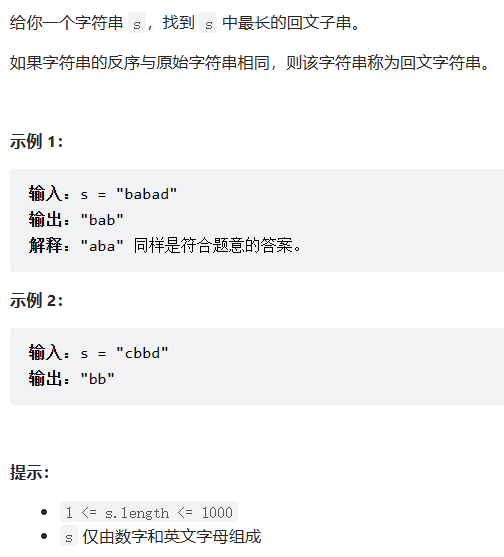

## 题目：



## 解题思路：

#### 中心扩展

由于回文子串是对称字符串，所以可以遍历字符串每个字母，看每个字母是否为某个回文子串的中心，方式是通过该字母左右两边是否对称判断

回文字串分为两种情况：

+ 字串字母为单数，中心为单个字母
+ 字串字母为双数，中心为两个字母

代码：

```c++
pair <int, int> expand_subString(string s, int left, int right) {
	while (left >= 0 && right < s.size() && s[left] == s[right]) {
		left--;
		right++;
	}
	return { left + 1, right - 1};
}
/// <summary>
/// 中心扩展方法
/// 回文子串分为两种：
///		奇数个，中心为一个字母
///		偶数个，中心为两个字母
/// </summary>
/// <param name="s"></param>
/// <returns></returns>
string longestPalindrome(string s) {
	int end = 0, start = 0;
	for (int i = 0; i < s.size(); i++) {
		auto [left1, right1] = expand_subString(s, i, i);
		auto [left2, right2] = expand_subString(s, i, i+1);
	}
	if (right1 - left1 > end - start) {
		start = left1;
		end = right1;
	}
	if (right2 - left2 > end - start) {
		start = left2;
		end = right2;
	}
	return s.substr(start, end - start + 1);
}
```

