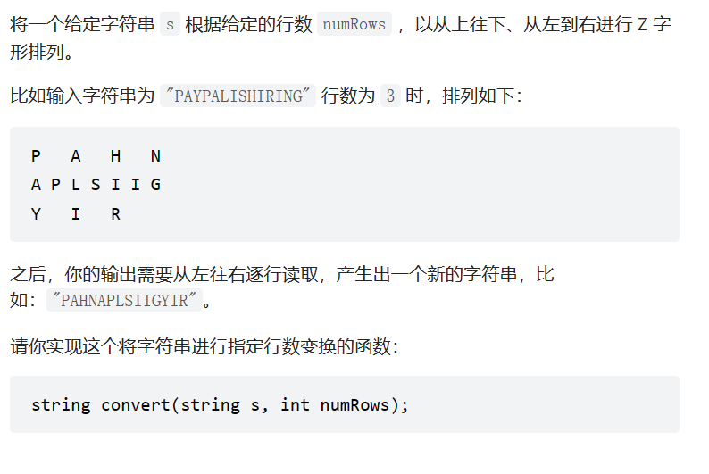
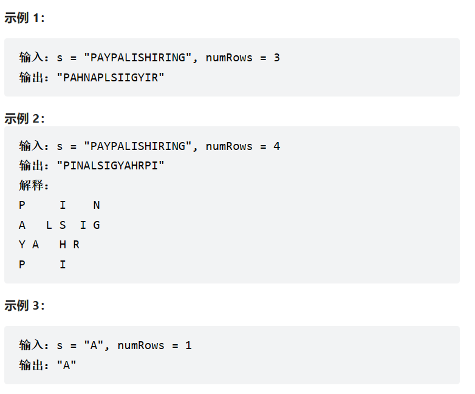
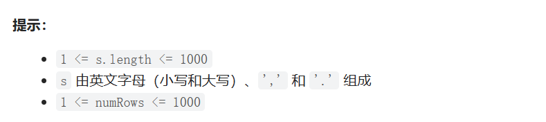

题目：







代码：

```c++
#include <iostream>
using namespace std;


string convert(string s, int numRows) {
	if (numRows <= 1) return s;
	char* p = new char[numRows];
	char* q = new char[numRows - 2];
	string sNew = "";
	//第一行
	int tag = 0;
	while (tag < s.size()) {
		sNew += s[tag];
		tag += (numRows * 2 - 2);
	}

	//第二行到倒数第二行
	for (int i = 1; i < numRows-1; i++) {
		int tag1 = i;
		int tag2 = (numRows * 2 - 2) - i;
		while (tag1 < s.size()) {
			sNew += s[tag1];
			if(tag2 < s.size()) sNew += s[tag2];
			tag1 += (numRows * 2 - 2);
			tag2 += (numRows * 2 - 2);
		}
	}

	//倒数第二行
	tag = numRows - 1;
	while (tag < s.size()) {
		sNew += s[tag];
		tag += (numRows * 2 - 2);
	}
	return sNew;
}

int maintm4() {

	//题目：N字形
	//输入：
	//	string str: 字符串
	//  int    num: 行数
	// 返回值：
	//  string newStr
	// 分析：
	// 当字符串str变换成N形时，
	// 第一列为前num个字符，也即[0,num-1]
	// 中间的斜线为num+1，也即[num,num+num-2]
	// 之后的，就不断重复前两步，一直到字符串结束
	cout << convert("PAYPALISHIRING", 4) << endl;
	cout << "PINALSIGYAHRPI" << endl;
	return 0;
}
```

