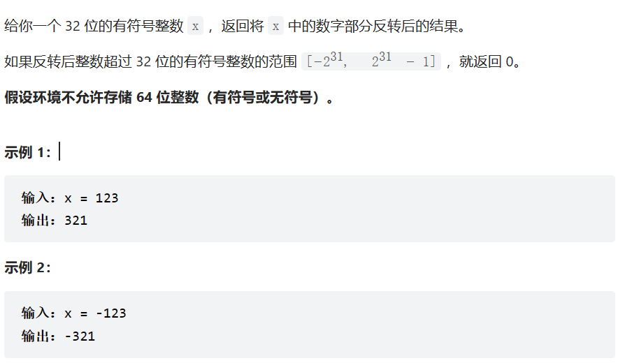
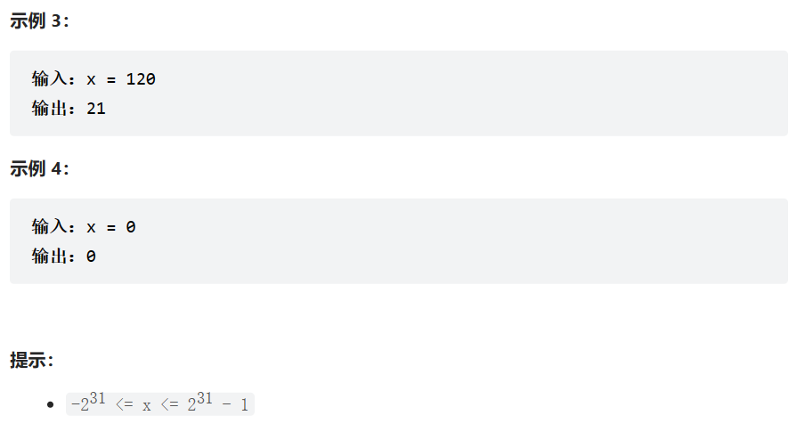

题目：





代码：

```c++
#include <iostream>
using namespace std;
//输入：int x 要反转的数字
//输出：int 翻转后的数字

int reverse(int x) {
	
	bool isRight = 1;
	if (x < 0) {
		isRight = 0;
	}
	x = abs(x);

	//求x的长度
	int num = x;
	int len_of_x = 0;
	while (num > 0) {
		++len_of_x;
		num /= 10;
	}

	//创建临时数组存储x的每一位
	num = x;
	int* p = new int[len_of_x];
	int p_i = 0;
	while (num > 0) {
		p[p_i++] = num % 10;
		num /= 10;
	}

	//创建翻转后数字
	long long res = 0;
	int i = 0;
	p_i--;
	while (p_i >= 0) {
		res += p[p_i--] * pow(10, i++);
	}
	if (res < (-pow(2, 31)) || res>(pow(2, 31) - 1)) {
		return 0;
	}
	if (!isRight) {
		return -1*(int)res;
	}
	return (int)res;
}
int main() {
	cout << reverse(-123) << endl;


	return 0;
}
```

